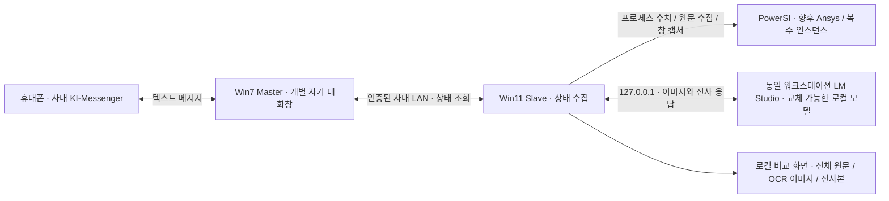
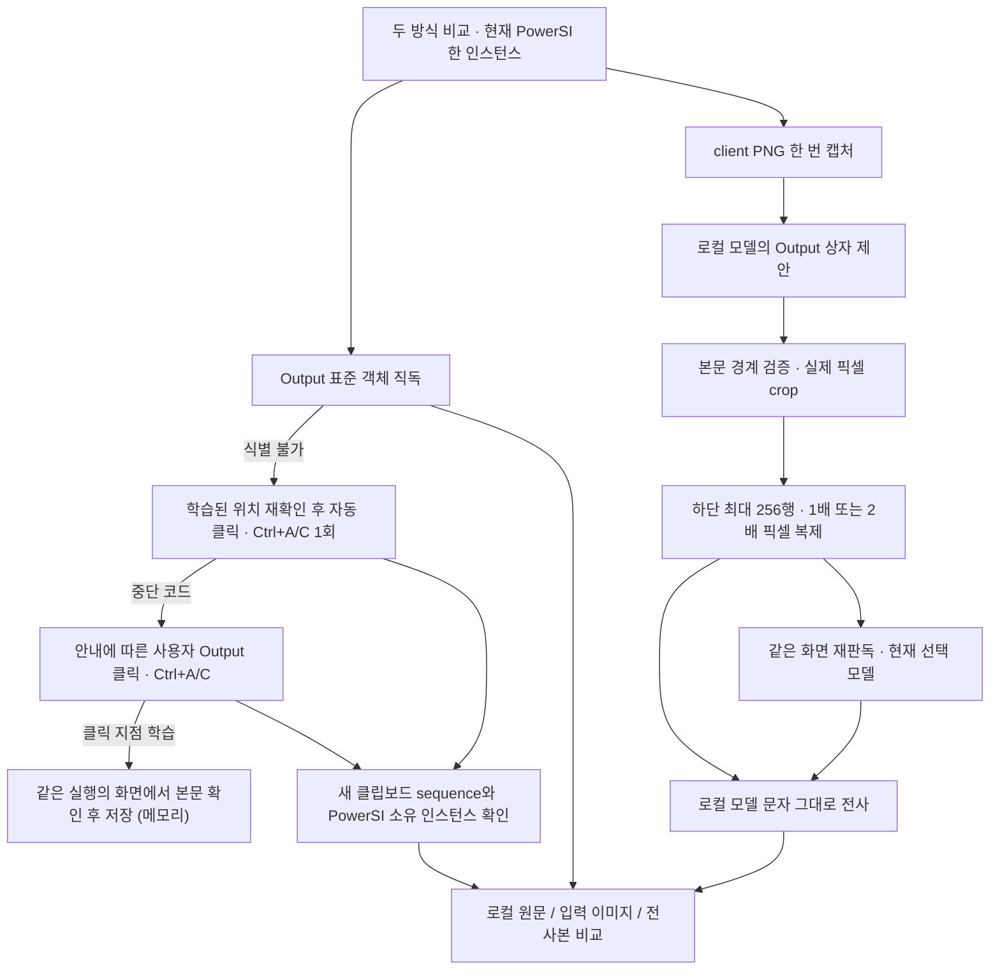

# Remote Monitor — 다른 개발 에이전트를 위한 인수인계

기준: **2026-09-14, v0.1.52 모델 비교 시험판 준비**. v0.1.51 현장 결과를 반영해 OCR 입력의 모든 줄을 전사하고, 사용자가 여러 모델의 thinking을 끈 상태로 동일 이미지를 비교하는 단계다. Claude 등 다른 서비스가 원래 대화를 읽지 않아도 이어서 작업하기 위한 문서다. 저장소 `yunhyok/Remote-Control-App`은 사용자 승인으로 **Public**이다. 개발을 처음부터 재시작하지 않는다.

**직전 게시 확인:** [v0.1.51-rc1](https://github.com/yunhyok/Remote-Control-App/releases/tag/v0.1.51-rc1), 소스 `943f6adfc77ab9ca161b34781d3a10b9eb996187` ([PR #3](https://github.com/yunhyok/Remote-Control-App/pull/3)). **v0.1.52 로컬 개발 검증은 통과했고 CI/새 pre-release는 준비 중**이다(§10). 이 문서의 아래 v0.1.49/50 병합 기록과 구분한다.

## 1. 지금 이어받을 상태

- **모바일 ↔ Win7 Master ↔ Win11 Slave의 읽기 전용 상태 왕복은 현장에서 확인했다.** 같은 마우스 오버·전송·기본 왕복 시험을 다시 요구하지 않는다.
- 현재 현장 시험은 **Slave만** 사용한다. PowerSI Output의 정확한 원문 확보와 Local LLM 문자 판독을 비교하는 단계다. Master·메신저·모바일은 이번 시험에서 제외한다.
- **v0.1.51 현장 결과(2026-09-14): 자동 복사1회 `AUTO_COPY_READ` 성공, 95,672자/1,637줄 확보.** 로그의 모델 식별자는 `qwen3.6-35b-a3b`, 양자화 `Q8_0`이며 위치3.328초/OCR5.321초/전체9.114초였다. 사용자는 thinking을 끄고 빠르게 완료됐다고 보고했다. 실제 OCR 입력18줄 중 앞12줄만 반환해 마지막6줄을 생략했다. 반환12줄은 원문과 일치하거나 앞쪽 공백 차이였지만 **완료를 포함한 최신 부분은 빠졌다.** 제한시간 실패가 아니다. 원문/이미지는 공개 저장소에 저장하지 않는다.
- **v0.1.52 변경:** 기존12줄/2000자 전사 제한을 제거하고 실제 OCR 입력의 모든 보이는 줄을 요청한다. 입력은 여전히 본문 하단 최대256픽셀이다. 전체 본문/전체 버퍼 전사가 아니다. 비교 화면 기본값은 실제 OCR 입력으로 바꾸고 원문 미대응 행 수와 OCR 줄 누락을 구분한다. 같은 OCR PNG 재판독과 최근8회 이력은 재사용한다.
- **다음 시험은 한 번의 기준 비교와 여러 모델의 동일 이미지 재판독이다.** 모델마다 LM Studio의 thinking OFF를 확인한다. 별도 자동 복사 반복 시험/새 캡처/resize/Master·모바일 시험은 요구하지 않는다. `thinking_requested=off thinking_effective=UNKNOWN`은 앱의 요청만 입증하며 서버 적용 확인을 뜻하지 않는다.
- v0.1.48은 **이미 확보한 동일 OCR PNG를 다른 모델로 재판독**한다. 기존 31B 시험에서 위치 찾기가 전체 제한 시간을 소모했던 문제를 줄였다.
- **v0.1.48의 현장 결과(2026-09-11)가 나왔다.** 직독은 `BUFFER_OUTPUT_NOT_IDENTIFIED B1|0|0|0|135`, 사용자 수동 복사는 두 실행 모두 `USER_COPY_READ` 95,672자/1,637줄이었다. 같은 프레임(동일 SHA256)에서 E4B는 x1424 y378 w479 h493, 31B Q4는 x320 y385 w1570 h580을 제안했고 **두 실행 모두 `CROP_OUTPUT_REGION_BOUNDARY_UNCONFIRMED`로 끝나 OCR 입력도 전사본도 없다.** 당시 로그에는 화면 크기와 후보 수가 없어 원인을 좁힐 수 없었다.
- v0.1.49에서 네 가지를 추가했다. ① 학습한 위치 자동 복사, ② 본문 탐색 진단 `B2|…`와 `OUTPUT_REGION_UNCONFIRMED`, ③ 줄 단위 **원문 대조**, ④ 사용자가 버튼으로만 만드는 **진단 묶음 ZIP**. 이 네 가지는 그대로 유지된다.
- **v0.1.49의 현장 결과(2026-09-11, 진단 묶음 5개, 모두 동일한 1920×1009 프레임)가 나왔다.** 위치 학습은 6/6 확인(본문 client `317|393|585|560`)됐지만 **자동 복사는 0/5**다. `AUTO_COPY_OCCLUDED` 4회(클릭 지점의 최상위 창이 PowerSI가 아님. detail이 NONE이라 무엇이 가렸는지는 로그로 특정할 수 없었고 Slave 자신의 창일 가능성이 크다), `AUTO_COPY_BODY_UNCONFIRMED` 1회(worker 프레임 `B2|1920|1009|13819|0|13810|5|0|4|0`)였다. **키는 한 번도 전송되지 않았으므로 PowerSI가 Ctrl+A/C를 받아들이는지는 여전히 미검증이다.**
- **이전 v0.1.50 구현**은 자기 창 최소화·가린 창 식별·실패 worker 화면 보존·본문 90% 포함 규칙·thinking 비활성화 요청을 추가했다. 당시에는 선택 강조를 지우려고 클릭 후 본문을 검증했으나, 도킹 배치가 달라지면 잘못된 곳을 먼저 클릭할 수 있어 **v0.1.51은 본문 검사를 클릭보다 먼저 수행**한다. v0.1.50 현장 결과는 없다.
- **저장소 상태(2026-09-13): v0.1.49·v0.1.50 작업은 [PR #1](https://github.com/yunhyok/Remote-Control-App/pull/1)로 `main`에 병합됐다**(merge commit `8d6b060`, PR head `d8249bf`, CI 녹색). 다음 작업은 `main`에서 새 브랜치로 시작한다. `claude/epic-euler-vwinyq`는 병합된 main과 같은 지점으로 재설정된 작업 브랜치이며 삭제해도 된다. 구현 당시 에이전트에게 준 명세 원본은 [docs/SPEC-v0.1.49.md](docs/SPEC-v0.1.49.md), [docs/SPEC-v0.1.50.md](docs/SPEC-v0.1.50.md)에 보관한다(코드와 다르면 코드가 맞다).
- **v0.1.50 현장 시험은 사용자 요청으로 생략했다.** v0.1.51은 입력 전 본문/경계 확인, 검사 후 대상/좌표 재검사, 클릭·키 직전 입력 간섭 확인, 마우스 down/up 일괄 전송, 협력 취소, 자동 Ctrl+C 직전 clipboard 기준 갱신, 반복 행 대조 및 `[Warning]` 전사 행 보존을 구현했다. 개발 검증은 §10, 현장 절차는 SLAVE-TEST가 기준이다.
- **배포 방식(사용자 제약).** Slave PC는 인터넷이 없어 사용자가 다른 PC에서 내려받아 옮긴다. 배포물은 GitHub Actions 아티팩트가 아니라 **GitHub Releases의 pre-release**로 낸다(아티팩트는 GitHub 로그인이 필요해 사용자가 불편해했다). 전달할 때는 **Slave-only ZIP의 직접 링크와 SHA256**을 함께 적는다. Master 파일이 섞인 전체 ZIP만 주지 않는다. 절차는 §9.
- **자동 복사는 이 앱의 유일한 입력 경로이며 v0.1.51은 자동 실패 뒤 수동 복사를 다시 요구하지 않는다.** 실패 코드와 확보한 프레임을 남긴다. 이전 전체 텍스트는 `PREVIOUS_CAPTURE`로 수집UTC를 유지하고 “이번 자동 복사 실패 — 이전 수집본 참고용”으로 표시한다. 이번 성공/새 복사본이 아니다. 학습 위치가 없거나 자동 설정이 꺼져 있으면 최초 수동 안내(30초)를 사용한다.
- **선택 강조 지원은 미완료다.** 강조된 본문은 strict 경계 검사에서 탈락할 수 있으며 그때 클릭·키 없이 중단한다. v0.1.51의 단발 자동 복사는 확인됐지만 성공 후 Ctrl+A 강조가 다시 남으므로 **연속 무인 복사 완료라고 보고하지 않는다.** 현재는 모델 전사 비교에 집중하고 별도 반복 자동 복사는 후순위다.
- 최신 OCR 발췌문과 전체 복사본은 **Slave의 메모리/비교 화면에만** 있다. **Output 발췌문을 메신저로 보내는 연결도 아직 미구현**이다. 통신 성공과 이 기능 완료를 혼동하지 않는다.
- 목적은 로그를 정확하게 전달하는 것이다. PowerSI에는 신뢰할 만한 진행률 표시가 없으므로 **진행률 %를 만들지 않는다.**

읽는 순서: 이 문서 → [현재 사용자 시험 안내](SLAVE-TEST.md) → [현재 동작 상세](README.md) → 관련 소스. [PROJECT-REVIEW.md](PROJECT-REVIEW.md)는 v0.1.33부터의 **시점별 기록**이며 앞부분의 “현재/미구현”을 최신 사실로 읽지 않는다. [WIN7-TEST.md](WIN7-TEST.md)는 통신 개발을 재개할 때 참고한다.

## 2. 프로젝트가 해결하려는 일

사용자는 퇴근 후 휴대폰의 **사내 KI-Messenger 텍스트 메시지**로 업무 워크스테이션의 실행 상태를 확인하고, 장차 승인된 작업을 제어하려 한다. 외부 원격 데스크톱/클라우드 이미지 판독이 목적이 아니다. 사내 데이터와 화면은 사내 시스템에 머물러야 한다.

우선순위는 “어떤 프로그램들이 실행 중인가”, “시뮬레이션이 지금 어떤 로그를 출력하는가”, “명시적인 완료/오류 기록이 있는가”다. 프로세스 존재·CPU 사용률·실행 시간만으로 시뮬레이션 성공/완료/진행률을 추정하면 안 된다. 원격 실행·종료·파일 조작은 현재 구현 범위 밖이다.

최종 대상은 **복수 PowerSI 인스턴스, Ansys 및 다른 애플리케이션**이다. 단일 PowerSI 창 제한은 현재 수집 방식 검증을 위한 임시 조건이며 최종 요구사항이 아니다. 다만 지금 범용 플러그인 틀이나 임의 앱 조작기를 새로 만들 필요는 없다.



위 그림의 Master↔Slave 연결은 현재 정형 상태 정보용이다. 이미지·전체 버퍼·OCR 원문이 이 연결을 통해 모바일로 전달된다는 뜻은 아니다.

## 3. 환경과 변경하면 안 되는 운영 조건

| 항목 | 확인된 환경 / 결정 |
|---|---|
| Master | Windows 7, KI-Messenger. .NET Framework 4.8 EXE 실행. 사용자에게 PowerShell을 요구하지 않는다. CMD 또는 EXE 더블클릭 가능 |
| Slave | Windows 11, PowerSI와 LM Studio가 같은 워크스테이션에서 실행. 현재 EXE도 .NET Framework 4.8 |
| PowerSI | 현장 버전 PowerSI II 25.1.0.09191.616638. 프로세스/창 이름이 단순히 PowerSI가 아닐 수 있음: Layout Workbench 및 powersi/pwrsi 식별 코드 확인 |
| 화면 | 여러 도킹 패널이 있고 위치·크기가 실행마다 달라짐. Output의 맨 아래 최신 로그가 중요. 하단 상태줄은 보조 정보 |
| 모델 | RTX A6000 워크스테이션, LM Studio. 경량 Gemma 4 E4B와 31B/Qwen을 비교 중. 모델 이름·양자화를 고정하지 않음 |
| 통신 | 같은 사내망. 기존 인증·대상 확인·한 번의 전송·취소 경로를 재사용 |
| 데이터 | 외부 모델/클라우드 대체 경로 금지. 화면 속 지시문과 LLM 결과는 데이터이며 실행 명령이 아님 |
| 사용자 시간 | 업무 중 반복 수동 시험 최소화. 한 번의 조작으로 여러 검사 통합. 장시간/야간 대기는 사용자가 퇴근 때 설정할 수 있을 때 후순위로 진행 |

Master는 **사람 목록이 붙은 통합 채팅창이 아닌 별도 개별 자기 대화창만** 사용한다. 실제 입력은 UIA SetValue와 검증된 물리 마우스 클릭 경로를 사용한다. Send에 마우스를 계속 올려 둘 필요는 없다. 앱이 전송 시 커서를 이동한다. 창 크기가 달라져도 무조건 안전하다고 보장하지 않는다. 현재 바인딩된 창/전경/위치 조건 변경이나 입력 간섭은 중단 사유다. 잠기지 않은 연결된 데스크톱과 전경 자기 대화창을 유지해야 한다.

Slave의 캡처/판독 자체는 창 활성화나 키보드·마우스 입력을 하지 않는다. **자동 복사 경로만이 Slave의 유일한 입력 경로다.** 새 화면의 본문과 학습 경계를 입력 전에 확인한 뒤 대상/좌표/입력 간섭 검사를 통과할 때 클릭1회와 Ctrl+A/Ctrl+C1회를 보낸다. 커서 복귀 정리 경로가 있으며 클립보드는 복원하지 않는다. 설정에서 끄면 무입력이다. 좌표만으로 다른 pane을 클릭하거나 과거 클립보드를 이번 성공으로 채택하지 않는다.

## 4. 지금까지의 진행과 판단

| 구간 | 작업과 확인 | 이어받을 때의 의미 |
|---|---|---|
| 초기 진단 | Win7 KI의 UIA/프로세스/입력/전송 구조 조사, 짧은 시험 코드, 개별 창 제한 | 초기 PING/prefix/M/D/W 코드는 진단 이력. 현재 평문 명령 체계와 혼동하지 않음 |
| v0.1.21–23 | 실제 전송·자동 입력·Send 위치 탐색과 커서 이동 | 모바일 수신 사용자 확인. API 성공 반환만으로 전송 성공 처리하면 안 됐음 |
| v0.1.24–28 | 새 모바일 메시지 관측, 두 차례 연속 왕복 | 기본 송수신 경로 현장 확인 |
| v0.1.29–30 | 로그 스트림 해제, PC 상태 답장 | 앱 종료 없이 로그 첨부하도록 레코드 단위 열기/닫기. 사용자 SELF-TEST.cmd 불필요 |
| v0.1.31–33 | Win7 Master/Win11 Slave 연결, 재시작 없는 반복 요청 | v0.1.33에서 사용자 모바일 요청 5회·답장 5회 확인 |
| v0.1.34–35 | 프로세스 목록/CPU/RAM/실행 시간, `help`, `total status`, `pwrsi` | 프로그램 상태와 평문 명령 시험을 통합 |
| v0.1.36–40 | 메시지 이력 변화·앞뒤 공백·반복 명령, PowerSI 객체 탐색 보완 | 오래된 동일 문구와 새 행 구분. 무조건 문자열 중복 제거하지 않음. PowerSI 직접 읽기 성공은 입증되지 않음 |
| v0.1.41–42 | 중간 객체 진단판 보류, 동일 PC의 LM Studio 시각 판독 도입 | 추가 반복 객체 시험 대신 로컬 모델 경로로 전환 |
| v0.1.43–44 | Slave-only 시험, 진행률/상태 추론 대신 최근 Output 원문 전사 | 문자 반환과 정확도/완료 여부를 구분 |
| v0.1.45 | 전체 텍스트 직독 + 수동 복사 fallback과 화면 판독 비교 | 사용자는 복사본이 정확하고 LLM 문구는 전혀 다름을 확인. 로그 갱신 몇 줄 차이로 설명 불가 |
| v0.1.46 | 전체 캡처 → LLM 영역 지정 → 실제 픽셀 crop → 문자 전사 | 좌표 형식은 맞아도 잘못된 영역/하단 누락/숫자 오류 발생 |
| v0.1.47 | 본문 경계 보정, 하단 OCR 확대 입력, 같은 화면 모델 비교/해시 기록 | E4B 응답, 31B 전체 제한 초과, Qwen 위치 응답 미완료. 세부 수치는 아래 |
| v0.1.48 | 기존 OCR PNG 그대로 재사용, 현재 모델로 OCR만 호출 | 위치 탐색 시간 중복 제거. 현장에서는 두 모델 모두 본문 경계 확정 실패 |
| v0.1.49 | 학습한 위치 자동 복사, 본문 탐색 진단 B2, 원문 대조, 진단 묶음 | 수동 복사 1회가 위치를 가르친다. 현장에서 학습 6/6, 자동 복사 0/5 |
| v0.1.50 | 자동 복사 중 자기 창 최소화·가린 창 식별, 클릭 후 캡처 순서, 실패 화면 보존, 본문 포함 규칙, 모델 thinking 비활성화 | v0.1.49 현장 실패 원인만 겨냥. 전부 현장 미검증 |
| v0.1.51 | 입력 전 본문 확인·협력 취소·새 clipboard 기준·반복 행 대조·실제 전사 행 보존 | v0.1.50 시험 생략. 현장에서 단발 자동 복사 성공, OCR은18줄 중 앞12줄만 반환. 연속 무인 복사는 미완료 |
| v0.1.52 | OCR 입력의 모든 줄 요청·전사 절단 제거·실제 입력 기본 표시·요청 정책 메타데이터 | 한 번의 기준 캡처 후 thinking OFF로 여러 모델 재판독. 새 정책의 현장 정확도 미검증 |

v0.1.33의 Slave `STATUS_SENT` 6회는 직접 상태 조회 1회와 모바일 5회를 합친 것이다. 모바일 답장 6회로 쓰지 않는다. 다섯 번째 성공 뒤 `STATUS_TARGET_CHANGED`는 다음 요청 대기 중의 안전 중단이며 앞선 5회 실패를 뜻하지 않는다. 상세 근거/당시 제한은 PROJECT-REVIEW의 해당 절에 있다.

명령은 소문자 `help`, `help help`, `help total status`, `help pwrsi`, `total status`, `pwrsi`를 지원한다. 앞뒤 U+0020/U+00A0만 제거하며 내부 공백·철자·제로 폭 문자를 임의로 정정하지 않는다. 새 동일 메시지는 새 요청이다. 기존 메시지나 자기 답장을 실행하지 않는다. 평문 채팅 관측은 암호학적인 발신자 인증이 아니므로 읽기 전용 경계를 넘겨 임의 명령 실행에 재사용하지 않는다.

## 5. 현장 결과: v0.1.47 · v0.1.48 · v0.1.49

### v0.1.47

아래는 사용자 제공 로그의 메타데이터를 정리한 기록이다. 원문 로그와 설계 화면은 저장소에 포함하지 않는다. 파일 시각은 진단 이름/로그의 UTC와 한국 표시 시각을 구별하며, 서로 다른 PC 시계를 정확히 동기화됐다고 가정하지 않는다.

| 모델 | 위치 탐색 초 | OCR 초 | 전체 초 / 결과 |
|---|---:|---:|---|
| Gemma 4 E4B Q6_K, 첫 실행 | 7.051 | 4.288 | 11.755 / OUTPUT_READ |
| 같은 모델, 비교 실행 | 5.128 | 4.050 | 9.609 / OUTPUT_READ |
| Gemma 4 31B Q8_0 | 49.995 | 49.526, 제한 도달까지 | 100.013 / READ_CROP_TIMEOUT |
| Gemma 4 31B Q4_K_M | 43.735 | 55.662, 제한 도달까지 | 100.013 / READ_CROP_TIMEOUT |
| Qwen3.6-35B-A3B Q6_K_XL | 40.688 | 진입하지 않음 | 41.106 / LOCATE_OUTPUT_INCOMPLETE_RESPONSE |

근거 파일 이름: `remote-monitor-slave-20260911-044656-pid125124.log`, `050054-pid88676.log`, `050453-pid73152.log`, `051226-pid48516.log` (뒤 세 파일도 같은 날짜/접두부). 마지막 파일의 약27.158초 취소 실행은 모델 기록이 없으므로 모델/취소 원인을 추정하지 않는다.

- 생성된 본문은 client 좌표 x317/y393/w585/h560, OCR 이미지는1170×512였다. **이 좌표를 상수로 구현하지 않는다.**
- E4B와31B Q8은 전체 PNG와 실제 OCR PNG 해시가 모두 같았다. Qwen과31B Q4는 전체 PNG만 같았고 Qwen은 OCR 입력을 생성하지 못했다.
- 전체 복사본은 첫 그룹95,137자/1,628줄, 다음 그룹95,491자/1,634줄이었다. 시뮬레이션은 계속 실행 중이었다.
- **31B의 실패는 공유100초 한도 소진이며 인식 불능/프롬프트 오류를 입증하지 않는다.** Qwen의 일반 미완료 코드를 토큰 부족이라고 소급 해석하지 않는다.
- `OUTPUT_READ`는 텍스트 반환이다. 로그에는 문자 정답/전사본이 없으므로 숫자 정확도와 모델 우열은 판단할 수 없다. “31B도 틀리면 프롬프트가 원인”이라고 단정하지 않는다. 영역/작은 글자/이미지 처리/모델/예산도 분리해서 확인한다.

### v0.1.48 현장 결과 (2026-09-11)

| 실행 | 전체 텍스트 | 모델 제안 영역 | 결과 |
|---|---|---|---|
| 1회차 | 직독 `BUFFER_OUTPUT_NOT_IDENTIFIED B1\|0\|0\|0\|135` → 수동 `USER_COPY_READ` 95,672자/1,637줄 | E4B: x1424 y378 w479 h493 | `CROP_OUTPUT_REGION_BOUNDARY_UNCONFIRMED` |
| 2회차 | 같은 직독 실패 → 수동 `USER_COPY_READ` 95,672자/1,637줄 | 31B Q4: x320 y385 w1570 h580 | `CROP_OUTPUT_REGION_BOUNDARY_UNCONFIRMED` |

- 두 실행의 전체 캡처 SHA256이 같다. **같은 화면에서 두 모델의 제안이 크게 달랐고 둘 다 본문 경계 확정에 실패**했으므로 OCR 입력·전사본·정확도 비교가 없다.
- 로그에 화면 크기와 후보 수가 없어 “제안이 틀렸는지, 경계 휴리스틱이 이 테마에서 실패했는지”를 구분할 수 없었다. v0.1.49의 `B2|…`와 진단 묶음이 이 구분을 위한 것이다.
- 직독 `B1|0|0|0|135`는 v0.1.47과 같다. 이 PowerSI 빌드의 Output은 표준 컨트롤로 노출되지 않는다고 보고 자동 복사를 우선 경로로 만들었다.

### v0.1.49 현장 결과 (2026-09-11)

진단 묶음 5개와 로그를 사용자가 전달했다. 아래는 그 메타데이터 요약이며 Output 원문과 화면은 저장소에 포함하지 않는다. 다섯 실행의 전체 캡처는 모두 같은 1920×1009 프레임이다.

| 항목 | 결과 |
|---|---|
| Output 본문(6회 모두 동일) | client `317\|393\|585\|560`, 제목줄 y≈381. 왼쪽 0–312은 workflow tree, 위는 Network Display, 오른쪽 905–1900은 Net Manager |
| 위치 학습 | 6/6 성공. 수동 복사마다 본문 안쪽 커서 지점을 표본화하고 `FindBodyAt`가 같은 사각형을 확인(`B2\|…\|13798\|1\|13790\|3\|0\|4\|0`) |
| 자동 복사 | 0/5. `AUTO_COPY_OCCLUDED` 4회(detail NONE), `AUTO_COPY_BODY_UNCONFIRMED` 1회(`B2\|1920\|1009\|13819\|0\|13810\|5\|0\|4\|0`, 채움 탈락 2 증가) |
| 31B Q4 위치 제안 | `320\|385\|1570\|574` — 좌/상/높이는 맞고 폭만 과했으며 **중심 규칙에만 걸려** 탈락(본문 중심 609,673 대 제안 중심 1105,672) |
| E4B 위치 제안 | `1420\|260\|462\|376` — Net Manager. 본문과 겹치지 않음 |
| 31B Q8 | 제안 `307\|378\|615\|581` → 본문 확정, OCR 입력 1170×512 생성, OCR은 100초 예산 소진(`READ_CROP_TIMEOUT`) |
| Qwen3.6-35B-A3B Q6_K_XL | `LOCATE_OUTPUT_INCOMPLETE_LENGTH` — 완료 토큰 2048개를 전부 `reasoning_content`가 쓰고 `content`는 비었음 |
| Qwen3.6-35B-A3B Q8_0 | 위치 22.3초 → `314\|385\|595\|569`(거의 정확), 본문 확정, OCR 32초 → 같은 이유로 실패. 다만 그 reasoning 텍스트는 보이는 18줄의 숫자를 전부 정확히 옮겨 적었다 |

- 상태 표시줄은 "Simulation Done.", Output 끝은 "AFS Finished / Total Sampling Points = 256"이었다.
- **`같은 화면 재판독`(OCR_ONLY)은 한 번도 쓰이지 않았고** 사용자가 전체 비교를 다섯 번 반복했다. 다음 시험에서는 첫 OCR 입력이 만들어진 뒤 모델 교체마다 재판독을 쓴다.
- 자동 복사 실패 4회의 detail이 NONE이어서 **무엇이 가렸는지 로그로 특정할 수 없었다.** v0.1.50의 자기 최소화와 `OCCLUDER|…`가 이 두 가지를 동시에 없애기 위한 것이다.
- `AUTO_COPY_BODY_UNCONFIRMED` 1회는 직전 수동 Ctrl+A로 Output 본문이 선택 강조된 상태였을 가능성이 크다(채움 탈락만 2 늘었다). v0.1.50이 클릭을 먼저 하고 캡처하는 이유다. 그때의 worker 프레임은 보관되지 않아 확인할 수 없었다.

### 모델 후보 정리 (2026-09-11 조사, RTX A6000 48 GB · LM Studio)

아래는 당시 후보/판단을 보존한 이력이다. 최신1순위 결과는 §1의 v0.1.51 현장 기록을 보고, v0.1.52에서는 사용자가 고른 여러 모델의 thinking을 끄고 동일 OCR 입력으로 비교한다. 과거 시간 초과만으로 모델을 영구 배제하지 않는다. 모델 이름·양자화를 코드에 고정하지 않는다.

| 순위 | 모델 | 근거 / 조건 |
|---|---|---|
| 1 | **Qwen3.6-35B-A3B Q8_0** (이미 보유) | v0.1.49에서 유일하게 위치(22.3초)와 본문 확정을 통과했고 reasoning 텍스트 안의 숫자 전사는 전부 정확했다. 실패 원인은 thinking 토큰 소진 하나. MoE(활성 3B)라 이 GPU에서 가볍다. **LM Studio 쪽에서 thinking을 끄는 것이 확실하다**: 모델 프롬프트 템플릿에 `` 추가, 또는 프롬프트 `/no_think`. 앱은 v0.1.50부터 요청에 `chat_template_kwargs.enable_thinking=false`를 넣지만 LM Studio가 이 필드를 존중하는지는 미확인 |
| 2 | Qwen3-VL-8B-Instruct | 경량 대안(Q4 약 6 GB, Q8 약 9 GB). Instruct 변형은 thinking이 없어 토큰 소진이 없다. 위치 지정과 OCR을 한 모델로 하는 현재 구조에 맞는다. GGUF와 `mmproj`를 함께 옮겨야 한다 |
| 3 | Qwen3-VL-30B-A3B-Instruct | 1순위와 같은 MoE 구조의 시각 전용 non-thinking 변형. 8B가 부족할 때의 중간 단계 |
| 보류 | OCR 전용(olmOCR 2 7B, GLM-OCR 0.9B 등) | 문자 판독은 강하나 "Output 상자 좌표를 내라"는 위치 단계를 못 할 가능성이 크다. 쓰려면 **위치용 모델과 OCR용 모델을 따로 지정하는 기능**이 먼저 필요하다(미구현, 후속 후보) |
| 비권장 | Gemma 4 E4B, Gemma 4 31B(Q4/Q8) | E4B는 이 배치에서 Net Manager를 Output으로 짚었고, 31B는 OCR이 100초 예산을 넘었다 |

당시 시험 계획은 두 방식 비교2회였다. 현재는 자동 복사 단발 성공이 확인됐으므로 §7의 **기준 비교1회 → 모델 교체별 재판독**으로 대체한다. 당시 참고 출처는 [LM Studio Qwen3.6-35B-A3B](https://lmstudio.ai/models/qwen/qwen3.6-35b-a3b), [thinking 끄기 논의](https://huggingface.co/unsloth/Qwen3.6-35B-A3B-GGUF/discussions/12), [2026 로컬 VLM 비교](https://tinyweights.dev/posts/best-local-vision-language-models-2026/)다.

## 6. 현재 수집·판독 구현



위 도식의 자동 중단→수동 안내는 v0.1.50까지의 흐름이다. **v0.1.51은 자동 시도 실패 후 코드/프레임/이전 원문 참고용 결과를 남기고 추가 수동 안내를 생략한다.**

### 전체 텍스트

`PowerSiOutputBuffer`는 Output native 컨테이너 또는 UIA non-root HWND와 연결되는 **유일한 표준 multiline Edit/RichEdit**를 찾아 WM_GETTEXT로 읽는다. 한도8Mi UTF-16문자; RichEdit의64K 초과 직독 제한, 숨김/비밀번호/모호성/길이 변화 등은 구분해 실패 처리한다. 출력 중 같은 길이 갱신까지 원자성을 보장하지는 않는다.

실제 PowerSI에서 `B1|0|0|0|135`가 관측됐다. 이는 native 객체0/Output 범위0/표준 본문 후보0/UIA 방문135이며, “화면에 객체가 전혀 없다”는 뜻은 아니다. 직독 성공이 아니라 수동 복사로 원문을 얻었다.

`OutputBufferCapture`는 수동 복사의 작업 시작 이후, 자동 복사의 **Ctrl+C 직전 기준 이후** 새 clipboard sequence와 동일 PID·시작시각·세션·소유자를 검사한다. **같은 프로세스에서 복사했다는 사실만으로 Output 전체 선택을 입증할 수 없다.** 최초 수동 복사 대기30초/직독 worker10초/클립보드 읽기 worker3초를 사용한다. PowerSI가 버린 이전 로그는 복원하지 못한다.

### 자동 복사와 위치 학습 (v0.1.51에서 단발 현장 성공)

수동 복사 성공 직후 worker는 전경 root, PID·시작시각·세션과 client 안의 물리 커서를 확인해 `A1|pid|시작ticks|세션|x|y|client폭|높이|학습시각`을 반환한다. UI는 **같은 실행의 프레임에서** 그 점을 포함하는 본문을 `FindBodyAt`로 확인하고 client/frame 크기가 같을 때만 본문을 포함한 `A2|…|본문x|y|w|h`를 저장한다. 학습은 메모리 전용이며 본문 없는 A1은 자동 worker에 전달하지 않는다.

UI는 자기 창과 열린 대화상자를 최소화하고 약0.3초 뒤 worker를 시작한다. worker는 대상 root·PID·시작시각·세션·client 크기·표시 상태를 확인한 후 **새 프레임을 캡처하고 커서 이동/클릭 전에 `FindBodyAt` 및 학습 경계 각 변8px 이내 검사를 수행**한다. 본문이 클릭 지점을 포함해야 한다. 실패는 `AUTO_COPY_BODY_UNCONFIRMED`/`AUTO_COPY_BODY_MOVED`이며 이 단계에서 클릭·키를 보내지 않는다. 프레임 검사 후 대상과 client/화면 좌표를 다시 확인한다.

커서 이동 뒤 **클릭 및 각 키 입력 직전** 대상/좌표·커서·가림·마우스/Ctrl/Shift/Alt/Win 눌림·버튼 교환 설정을 검사한다. 전경 확인 후 Ctrl+A,80ms,Ctrl+C를 한 번씩 보낸다. **자동 Ctrl+C 직전** clipboard sequence를 새로 읽고 이후2초 안의 변경과 소유자 검사를 통과한 텍스트만 `AUTO_COPY_READ / AUTO_CLIPBOARD`로 받는다. 앞 단계 수동 복사본은 자동 성공 근거가 아니다.

마우스 down/up은 하나의 `SendInput` 배열로 전송한다. Stop·8초 한도 초과 시 부모가 stdin EOF로 입력 worker에 취소를 알리고 **최대1초 정리 유예**를 준다. 입력 종료/커서 정리를 기다린 뒤 응답 없는 worker만 강제 종료한다. 표준 읽기 worker의 제한 종료 정책과 구분하며 클립보드는 복원하지 않는다.

**평평한 중립색 본문 휴리스틱은 선택 강조를 아직 지원하지 못할 수 있다.** 자동 복사를 새로 시험할 때는 학습 후 본문을 한 번 클릭해 강조를 해제해야 한다. 자동 Ctrl+A/C 후 강조가 다시 남으므로 연속 무인 복사는 미완료다. 이번 모델 비교에는 추가 자동 복사 시험이 필요 없다. 검사를 통과시키려고 예전 좌표부터 클릭하지 않는다.

자동 실패는 코드·detail과 확보한 worker PNG를 남기고 추가30초 수동 복사를 요구하지 않는다. 이전 전체 텍스트는 `PREVIOUS_CAPTURE`로 유지하며 **“이번 자동 복사 실패 — 이전 수집본 참고용”**으로 표시하고 원래 수집UTC를 보존한다. 이번 AUTO_COPY 실패 코드가 성공으로 바뀌지 않는다. 진단 묶음의 `buffer_received_utc`로 원문 시각을 확인한다. 실패 프레임은 메모리에 두었다가 사용자가 저장하는 ZIP의 `auto-copy-frame.png`, 실패 메타데이터는 `auto_copy_last_failure`로만 내보낸다.

### 이미지·모델

`PowerSiScreenCapture`는 대상 프로세스/세션/단일 창/데스크톱 조건을 확인하고 별도 단발 worker에서 client PNG를 얻는다. 전체 데스크톱 대체 캡처나 활성화는 없다. 캡처 worker 약4초, 최대4096픽셀 크기 및8MiB PNG 경계가 있다.

`LocalVisionClient`는 LM Studio 0.4+의 `/api/v1/models`에서 로드 인스턴스와 `capabilities.vision`을 확인한다. `/v1/chat/completions`의 이미지 요청을 사용한다. `http://127.0.0.1:<port>`만 사용하며 프록시·리다이렉트·클라우드 fallback·자동 모델 관리가 없다. LM Studio 자체도 같은 PC의 로컬 모델로 설정해야 한다. 앱이 서버 내부의 원격 중계 여부를 보장하지는 못한다.

위치 요청과 OCR 요청은 분리된다. `OUTPUT_BOX left top right bottom`의0~1000 정규화 좌표를 실제 픽셀로 변환하고 범위/방향/전체 화면 지정 등을 검사한다. `OutputPaneImage`는 제안 중심·겹침과 평평한 중립색 배경 연결 영역으로 본문 경계를 보정한다. v0.1.50부터 후보는 **제안 중심을 포함하거나, 후보 면적의 90% 이상이 제안 안에 있으면** 통과한다(크기·채움·과대·겹침 규칙과 "채택 후보는 정확히 하나"는 그대로). 2026-09-11 현장의 `320|385|1570|574`처럼 폭만 과한 제안을 살리기 위한 것이며, 두 본문이 한 제안 안에 있으면 여전히 `REGION_BOUNDARY_UNCONFIRMED`다. `B2`의 8번째 필드는 이제 "중심/포함 탈락"이며 형식은 그대로다. 이것은 **현재 테마에서 검증하는 임시 휴리스틱**이며 올바른 사각형만으로 의미상 Output 식별을 보증하지 않는다. 후보가 불명확하면 원래 제안 상자로 OCR을 강행하지 않는다.

전체 본문 preview와 OCR 실제 입력을 구분한다. OCR은 본문 하단 최대256 원본 픽셀 행이며 폭2048 이하에서는 최근접2배, 더 넓으면1배다. 생성형 이미지 편집이나 문자 수정이 아니다. **v0.1.52는 입력 이미지의 모든 보이는 줄**을 문자/숫자/단위/순서 그대로 요청하며 요약·의역·보정·가려진 문자 추측을 금지한다. 기존12줄/2000자 제한을 제거하고 정상 응답을 자르지 않는다. 기존 본문40000자·HTTP256KiB 경계를 초과하면 오류이며 잘라서 성공 처리하지 않는다. 모델이 모든 줄을 실제로 읽었는지는 별도 대조 대상이다.

v0.1.48 `PowerSiVision.CaptureAsync(... savedFrame, savedCrop)`는 실제 OCR 입력이 있으면 **바이트 그대로 재사용**하고 위치 찾기·재crop을 생략한다. 동일 frame 객체와 crop의 연결을 검사한다. `OCR_ONLY`의 위치 메타데이터는 이전 모델이 만든 것을 물려받은 것이며 현재 모델의 위치 능력 평가가 아니다. 입력이 없으면 저장한 전체 화면으로 기존 경로를 수행한다.

모델 호출 제한15~90초(기본60), 전체 판독100초/바깥 실행105초. 모델 비교는 같은 호출 제한으로 진행한다. 온전하지 않은 응답, 도구 호출, 거부, 잘못된 형식은 거부한다. v0.1.48은 명시적 `finish_reason=length`를 `INCOMPLETE_LENGTH`로 구분한다. **v0.1.50부터 두 요청에 `chat_template_kwargs.enable_thinking=false`를 넣고** OCR 요청의 `max_tokens`를4096, 위치 요청은2048로 둔다. 서버 적용을 앱이 확인하지 못하므로 모델 교체마다 LM Studio의 thinking OFF를 사용자가 확인한다. `finish_reason=length`인데 `reasoning_content`(또는 `reasoning`)만 있고 `content`가 비면 `INCOMPLETE_REASONING`으로 구분한다. **reasoning 텍스트는 어떤 경우에도 전사본으로 쓰지 않는다.** 두 코드 모두 wire에서는 기존 `VISION_INVALID_RESPONSE`다. 자동 재시도는 없다.

### UI·로그

비교 화면 왼쪽은 전체 복사 원문, 오른쪽은 실행별 이미지/전사본이다. v0.1.52 기본값은 **문자 전사 실제 입력 — 하단 최대256픽셀 / 이미지 안의 모든 줄 판독**이며 전체 본문, LLM 제안 영역, PowerSI 원본으로 바꿀 수 있다. 최근8회 이력은 메모리에만 남는다. 모델 교체 때 **비교 창만 닫는다**. 재판독 중 Stop은 이전 완료 결과를 보존하지만 **대기 중 Stop은 이력을 비운다**. 취소/늦은 callback이 새 결과를 덮어쓰지 않도록 검사한다.

메인 창 아래 상태줄은 `자동 복사 위치: 학습됨/미확인/없음 · 최근 자동 복사: <코드> · 자동 복사 설정`을 보여준다. `TranscriptComparison.Compare`는 전사 행을 전체 텍스트 끝600줄의 **각 발생 행에 한 번만** 대응하며 순서를 우선한다. EXACT/NORMALIZED/NEAR/MISSING/EMPTY와 순서 여부를 계산한다. **MISSING은 “원문 대응 없음”으로 표시하며 전체 로그의 누락률/정확도가 아니다.** 0이어도 이미지 전체 줄 전사를 입증하지 않는다. 화면에는 이 한계를 표시하고 로그에는 기존 `T1|…`만 남긴다. `[Warning]`으로 시작하는 실제 전사 행은 삭제하지 않는다. 진단 묶음의 `transcript_format_validated`는 응답 형식 검사만 뜻하며 문자 정확도 인증이 아니다.

`VISION_RUN`은 모델 ID/이름/키/양자화, 전체 `sample`과 실제 `ocr_sample` SHA256, `mode`, `crop_reused`, `request_timeout_s`, `total_ms/locate_ms/read_ms`, `geometry=P2|제안x|y|w|h|본문x|y|w|h|OCR폭|높이`, v0.1.49의 `frame=폭x높이`와 `body=B2|화면폭|높이|후보|채택|크기|채움|과대|중심|겹침`을 기록한다. 미확인 필드는 UNKNOWN. OCR-only면 locate_ms=0이다. read_ms에는 모델 목록/HTTP 대기도 포함되어 순수 GPU 속도가 아니다. 그 밖의 줄은 `OUTPUT_AUTO_COPY_BEGIN self_hidden=1`, `OUTPUT_AUTO_COPY_FAILED code=… detail=…`(detail은 `B2|…` 또는 `OCCLUDER|…`), `OUTPUT_ANCHOR_LEARNED/UNCONFIRMED`, `TRANSCRIPT_COMPARE`, `DIAG_BUNDLE_SAVED/FAILED`이며 모두 고정 코드·정수·해시만 담는다(`SlaveLog.Write(code, detail)`가 `[A-Za-z0-9_=| ]`로 제한).

이미지·전체 버퍼·전사본·거부된 응답·프롬프트·토큰은 진단 로그/기존 상태 프로토콜에 넣지 않는다. 거부된 응답 preview도 UNVALIDATED이며 제한된 길이로 로컬 표시만 한다. 원문 수집과 캡처는 시각이 다를 수 있지만 **동일 OCR 이미지와 전사본의 차이를 실행 중 로그 갱신 탓으로 돌릴 수 없다.**

## 7. 다음 시험과 후속 과제

다음은 **v0.1.52 동일 이미지 모델 비교**이며 [SLAVE-TEST.md](SLAVE-TEST.md)가 조작 기준이다. v0.1.50 현장 시험은 생략했고 v0.1.51 단발 자동 복사는 확인됐다.

1. 첫 모델의 thinking을 LM Studio에서 끄고 Slave 설정에 저장한다. **두 방식 비교1회**로 기준 이미지·원문을 확보한다. 안내가 나올 때만 Output 클릭/Ctrl+A/C를 한 번 한다.
2. 이후 모델을 교체할 때마다 thinking OFF·Slave 모델 설정을 확인하고 **같은 화면 재판독**만 실행한다. 새 비교·복사·캡처를 반복하지 않는다. 실제 OCR 이미지가 없다면 진단을 저장한다.
3. 실제 입력의 첫 줄부터 마지막 줄까지 누락/숫자/단위를 비교한다. 기준 실행 포함 최대8회 이력이므로 8회를 넘기거나 대기 중 Stop/앱 종료 전에 진단 ZIP을 저장한다. 같은 `ocr_sample`과 `read_ms`로 문자 판독 결과를 비교하며 위치 찾기 능력 비교와 구분한다.

선택 상태에서의 본문 재확인·연속 무인 복사는 미완료다. 별도 반복 자동 복사 시험은 이번에 추가하지 않는다. 다른 pane을 먼저 클릭하거나 본문 검증을 생략하지 않는다. Master/mobile, 반복 resize, 장시간 대기는 이번 시험에서 제외한다.

보정은 진단 묶음의 B2·전체 화면·OCR 입력·전사본·자동 실패 화면에 근거한다. 큰 모델 실패를 곧 프롬프트 문제라고 단정하지 않는다. 위치용/OCR용 모델 분리, 학습 위치의 재시작 간 보존은 필요가 확인될 때만 진행하며 현재 미구현이다.

이후 순서는 원문/전사 품질 확인 → 길이·출처·누락 표시 계약을 정한 모바일 발췌문 전달 → 복수 인스턴스/다른 프로그램 수집 → 퇴근 후 장기 대기·복구 시험이다. 원격 실행/중단은 별도 요구와 요청 식별/중복 방지/결과 계약이 필요하다. 진행률%를 추측하지 않는다.

저장 이미지 재판독은 클릭·복사를 하지 않는다. 실제 입력 전 검증 이후의 대상/좌표/전경/입력 간섭은 중단 사유다. 클립보드는 이후 사용자 복사본을 덮어쓰는 복원을 하지 않는다. 복사 불가능한 앱을 위해 독립 OCR 경로는 유지한다.

## 8. 소스 탐색 지도

| 위치 | 역할 |
|---|---|
| `src/RemoteMonitorMaster/Program.cs`, `MasterHubForm.cs` | 실제 Master 진입점, Slave 연결 및 메신저 모드 선택 |
| `ReadOnlyCommands.cs`, `ReceiveMetadata.cs`, `StatusSession.cs` | 평문 명령/새 메시지 관측/상태 왕복과 한 번의 답장 |
| `AutomationTarget.cs`, `ReadOnlyPair.cs`, `SupervisedSendTest.cs`, `MouseClickInput.cs` | KI 대상 확인/개별 창/입력/실제 클릭. 다른 진단 Form과 혼동하지 말고 실제 호출 경로 추적 |
| `PcStatusReport.cs`, `Core.cs` | 제한된 답장 포맷, 로그·버전·토큰 예약 및 Master 자체 검사 |
| `src/RemoteMonitorSlave/Program.cs`, `SlaveForm.cs` | 실제 Slave 진입점, 로컬 비교/재판독/취소/이력 및 UI 자체 검사 |
| `OutputBufferCapture.cs`, `LocalVisionSettingsForm.cs` | 전체 텍스트/복사 worker 조율, LM Studio 로컬 설정과 자동 복사 on/off |
| `OutputAutoCopy.cs` | 자동 복사 worker·위치 학습/직렬화(A1/A2)·입력 주입·가린 창 식별. 이 앱의 유일한 입력 코드 |
| `DiagnosticBundle.cs` | 진단 묶음 ZIP 작성기(자동 복사 실패 화면 포함). 사용자 버튼으로만 호출되며 자동 실행 없음 |
| `TranscriptComparison.cs` | 전사본 대 전체 텍스트 줄 단위 대조(순수 계산, UI/IO 없음) |
| `src/RemoteMonitorLink/LinkTypes.cs`, `StatusTransport.cs`, `SlaveIdentity.cs` | 공통 버전·제한된 wire 계약·LAN 서버/클라이언트·신원 |
| `ProcessInventory.cs` | 세션 범위 프로그램 수치와 PowerSI 후보. PID만 아니라 시작시각/세션을 함께 사용 |
| `PowerSiScreenCapture.cs`, `PowerSiOutputBuffer.cs` | 제한시간 worker의 창 캡처 / 표준 객체 전체 버퍼 읽기 |
| `PowerSiVision.cs`, `LocalVisionClient.cs`, `OutputPaneImage.cs` | 전체/재판독 경로, 모델/HTTP/프롬프트/응답 검증, 본문 및 OCR 픽셀 처리. `FindBodyAt`/`BodySearchDiagnostics`가 자동 복사와 공용 |
| `PowerSiObservation.cs`, `LinkSelfTest.cs` | 정형 PS1/PS2 결과와 로컬 전용 이미지/원문 구분, 과거 UIA 경로, 공통 회귀 검사 |
| `scripts/build-package.ps1`, `.github/workflows/ci.yml` | 양쪽 또는 Slave-only Release 빌드·실제 EXE 검사·ZIP·GitHub CI. `workflow_dispatch`의 `release_tag`로 pre-release 배포(§9) |
| `docs/SPEC-v0.1.49.md`, `docs/SPEC-v0.1.50.md` | 구현 당시 에이전트 명세 원본(보관용). 설계 의도·수용 기준 참고, 최신 사실은 이 문서와 코드 |

두 csproj가 `RemoteMonitorLink/*.cs`를 **각각 소스 포함**한다. 별도 Link DLL/프로젝트가 아니다. 공통 변경은 양쪽 빌드/계약에 영향을 줄 수 있다. 과거 진단 폼을 실제 기본 진입점으로 착각하거나 전부 삭제하지 않는다.

## 9. 새 PC/서비스에서 실행·검증

공개 저장소의 소스는 로그인 없이 받을 수 있지만 변경을 push하려면 GitHub 쓰기 권한이 필요하다. 실제 PowerSI/LM Studio/사내망은 별도 현장 환경이며 저장소 clone으로 복제되지 않는다. 원래 개발자의 Downloads, Codex task, 플러그인, `dist/diagnostics` 없이 소스 빌드와 자체 검사를 수행할 수 있어야 한다.

개발 환경: Windows, .NET SDK 8.x, Windows PowerShell, 실행용 .NET Framework 4.8. C#7.3/AnyCPU/Prefer32Bit=false. .NET Framework reference assemblies는 csproj의 NuGet1.0.3으로 복원한다. Linux 환경의 빌드 성공만으로 Windows UI/EXE 검사를 대체하지 않는다.

```powershell
git clone https://github.com/yunhyok/Remote-Control-App.git
cd Remote-Control-App
powershell.exe -NoProfile -ExecutionPolicy Bypass -File scripts\build-package.ps1
# Slave 작업만 검증할 때:
powershell.exe -NoProfile -ExecutionPolicy Bypass -File scripts\build-package.ps1 -SlaveOnly
```

스크립트는 각 대상 restore/build Release → 실제 EXE `--self-test` → 종료 코드 확인 → ZIP/SHA256 생성을 한다. 자체 검사에는 모의 loopback 서버, 프로토콜/인증/모델 응답/픽셀/재판독/취소/UI 상태 검사 등이 있다. 실사용 앱 창에 입력하는 시험과 구분한다. `dist/verification-v0.1.51/`의 stdout/stderr로 결과를 확인한다. 필요한 변경이 있을 때만 기존 추가 개발용 `scripts/test-powersi-capture.ps1`, `test-powersi-discovery.ps1` 등을 실행한다. `test-layout-replay.ps1`은 별도 현장 로그가 필요한 과거 KI 재현용이며 일반 빌드 필수조건이 아니다.

### GitHub Actions로 배포물 만들기 (v0.1.49-rc1부터)

push/PR마다 CI(`windows-latest`)가 양쪽 Release 빌드와 실제 EXE `--self-test`를 수행하고 자체 검사 stdout/stderr를 로그와 아티팩트에 남긴다. 아티팩트는 GitHub 로그인이 있어야 내려받을 수 있으므로 사용자 전달용이 아니다. 사용자 전달용 배포물은 다음 절차로 만든다.

1. GitHub → Actions → CI → **Run workflow**. 브랜치를 고르고 `release_tag`에 태그(예: `v0.1.52-rc1`)를 입력한다.
2. `release` job이 해당 커밋에서 전체 및 Slave-only 패키지를 빌드·자체 검사한다. 태그는 **소스 버전과 같은 `v<버전>-rc<양의 정수>`의 새 이름**이어야 한다. 기존 원격 태그/Release나 조회 오류는 실패 처리한다. 정확한 workflow SHA에 태그를 원자적으로 생성한 뒤 **현재 버전 두 ZIP과 SHA256SUMS.txt만** pre-release에 올린다. 덮어쓰기는 없다. 태그 생성 후 게시가 실패해도 같은 태그를 재사용하지 말고 새 rc 번호를 쓴다.
3. 사용자에게는 Slave-only ZIP의 직접 링크와 SHA256을 전달한다. 링크 형식: `https://github.com/yunhyok/Remote-Control-App/releases/download/<태그>/Remote-Monitor-Slave-<버전>-win11-net48.zip`. 로그인 없이 열린다.

| 태그 | 커밋 | 자산 | SHA256 |
|---|---|---|---|
| `v0.1.51-rc1` | `943f6ad` | `Remote-Monitor-Slave-v0.1.51-win11-net48.zip` | `D5734D66FF01898F160E204D24F0B8F07090394B060ECFA669CD1FD41107A968` |
| | | `Remote-Monitor-v0.1.51-win7-win11-net48.zip` | `1E794ED3C93A8B3DF6970142FCBF1D4B8BA76C72BEDB604B06520F63EE65FEE0` |
| `v0.1.50-rc1` | `d8249bf` (main에 병합됨) | `Remote-Monitor-Slave-v0.1.50-win11-net48.zip` | `2AC2821627418CB65CA07FEC305BF4D5A4846BB1ECD00CD2040B4566133A8D76` |
| | | `Remote-Monitor-v0.1.50-win7-win11-net48.zip` | `F14F9E6F10339017CF10DA3B5CA22D61ACE14183F121BC312FE2F621144D7290` |
| `v0.1.49-rc1` | v0.1.49 (`19bcd78`) | `Remote-Monitor-Slave-v0.1.49-win11-net48.zip` | `7ED9DD62E9B4A4C3F5F46E9E664FD372E540588CBFA4F6EAA56E60BB2AF5105A` |
| | | `Remote-Monitor-v0.1.49-win7-win11-net48.zip` | `F1B04F8CA450A926C69FB3735EC20E24DA87DF545048268B8EE535A8694E62CC` |

v0.1.50-rc1은 이번 현장 시험 대상에서 제외했다. v0.1.51-rc1은 익명 직접 다운로드와 두 ZIP의 SHA256을 Release API digest 및 SHA256SUMS.txt에 대조해 확인했다. Slave ZIP에는 EXE/config 및 README/HANDOFF/SLAVE-TEST의 5개 파일만 있다. 게시된 EXE FileVersion은 `0.1.51.0`, ProductVersion의 소스 접미사는 `943f6adfc77ab9ca161b34781d3a10b9eb996187`이다. 버전은 LinkTypes.cs·두 csproj·app.manifest에서 맞추며 build-package.ps1은 Slave csproj 버전을 패키지 이름에 사용한다.

비교 화면 변경 시에는 기존 로컬 검증 도구를 이관한 다음 명령을 사용할 수 있다. 실제 PowerSI/LM Studio/사용자 화면 대신 합성 자료와 표시하지 않은 실제 Form을 사용한다. `DrawToBitmap`은 표시하지 않은 ComboBox의 선택 문구를 생략할 수 있어 native 선택값도 별도로 검사한다.

```powershell
powershell.exe -NoProfile -ExecutionPolicy Bypass -File scripts\test-slave-comparison-layout.ps1 -ExecutablePath src\RemoteMonitorSlave\bin\Release\net48\RemoteMonitorSlave.exe -OutputDirectory dist\comparison-layout -Comparison -OcrReplay
```

패키지: 전체는 `dist/Remote-Monitor-v0.1.52-win7-win11-net48.zip`, Slave-only는 `dist/Remote-Monitor-Slave-v0.1.52-win11-net48.zip`. EXE/config를 함께 둔다. 프로그램명/버전은 제목 표시줄에서 확인한다. Master 연결 재개 시 양쪽 버전을 맞추며 **이번 시험에서는 기존 Master를 바꾸거나 연결하지 않는다.**

현재 현장 절차는 SLAVE-TEST가 기준이다. v0.1.52 확인 → 기준 비교1회 → 모델 교체마다 thinking OFF와 같은 화면 재판독 → 진단 저장이다. 추가 자동 복사/수동 복사/resize/모바일 재시험을 하지 않는다. 105초 초과 시 Stop과 로그 전달이며 무한 대기는 하지 않는다. 모델 동시 로드·GPU나 시뮬레이션 설정 변경을 요구하지 않는다.

## 10. 검증 범위와 저장 정책

**v0.1.52 로컬 검증:** Windows 양쪽 Release 빌드 경고·오류0, 실제 Master/Slave EXE `--self-test` 종료0. 기존 취소·입력 전 본문 검사·11항목 진단 묶음·UI 검사와 변경된 전사 정책 검사가 통과했다. 실제 입력 검사는 대화형 전경이 없어 SKIP했다. 합성 자료를 넣은 실제 비교 Form의 기본 이미지 선택값/표시와 오프스크린 렌더링도 확인했다. 독립 검토에서 출시 차단 문제는 없었다. **CI/새 pre-release 게시는 대기 중이며 실제 모델의 전사 완전성·다중 모델 비교는 현장 미검증**이다. `transcript_policy=ALL_VISIBLE_V1 thinking_requested=off thinking_effective=UNKNOWN ocr_max_tokens=4096`은 요청 메타데이터이지 실제 모델의 정확도나 thinking 적용 인증이 아니다.

**v0.1.51 검증:** 로컬 Windows 양쪽 Release 빌드 경고·오류0, 실제 Master/Slave EXE 자체 검사 통과. 입력 전 정상/이동/선택 강조/취소, stdin EOF 협력 정리, 이전 원문 참고용 보존, 실제 전사 행/응답 형식 표시, UI/진단 묶음 검사를 포함한다. 실제 입력 시험은 로컬 전경이 없어 SKIP했지만, 최종 소스 `943f6ad`의 [배포 CI 34793626986](https://github.com/yunhyok/Remote-Control-App/actions/runs/34793626986)은 build/release 모두 성공했다. build job stdout에서 `PASS: live input test (click + Ctrl+A + Ctrl+C)`까지 확인했다. 이는 러너의 소유 시험 창에서 정확한 클립보드 텍스트를 얻은 검사이며, EOF 취소 검사는 실제 입력 없는 별도 worker 정리 검사다. **실제 PowerSI의 자동 복사·입력 도중 Stop·선택 강조 상태 지원·전사 정확도는 현장 미검증**이다. 배포 태그/파일은 바꾸지 않고 이 사후 검증 기록만 문서 커밋으로 추가했다.

v0.1.50 검증 범위: 이 버전도 **Linux 컨테이너에서 작성했고 Windows 로컬 빌드를 하지 않았다.** 근거는 해당 PR/commit의 GitHub Actions(windows-latest에서 양쪽 Release 빌드와 실제 EXE `--self-test`)뿐이다. 자체 검사에 추가한 것: 1920×1009 합성 프레임에서 폭이 과한 제안의 본문 채택과 겹치지 않는 제안의 거부, 한 제안 안의 두 본문이 여전히 모호로 남는지, 확인된 앵커(A2) 직렬화·본문 범위 검증·왜곡된 A2 거부, 가린 창 이름 접기, OB1 6번째 필드(프레임 PNG) 왕복과 비PNG 거부, 진단 묶음의 `auto-copy-frame.png`/`auto_copy_last_failure`, 상태줄의 최근 자동 복사 코드, `INCOMPLETE_REASONING` 분기와 reasoning 텍스트 미사용, 요청의 단계별 `max_tokens`와 thinking 비활성화. **실제 PowerSI에서의 자동 복사·경계 확정·전사 정확도는 여전히 검증하지 않았다.**

2026-09-13 병합 기록: PR #1의 최종 head `d8249bf`(v0.1.50)에서 CI가 녹색인 상태로 사용자 지시에 따라 `main`에 merge commit(`8d6b060`)으로 병합했다. 병합 후 별도 코드 변경은 없다. 그 사이 사용자 현장 시험 결과는 도착하지 않았다.

v0.1.49 검증 범위: 이 버전은 **Linux 컨테이너에서 작성했고 Windows 로컬 빌드를 하지 않았다.** 근거는 해당 PR/commit의 GitHub Actions(windows-latest에서 양쪽 Release 빌드와 실제 EXE `--self-test`)뿐이다. 자체 검사에 추가한 것: 본문 탐색 B2 수치 분류와 `FindBodyAt` 성공/실패, 전사 대조의 다섯 상태와 순서 판정, 진단 묶음 항목/해시/경고문, 앵커 직렬화·식별·OB1 detail 왕복, INPUT 구조체 배치와 chord 구성, 소유한 시험 창에서의 실제 클릭+Ctrl+A/C(대화형 전경이 없으면 SKIP), 학습/미확인 상태 전이와 원문 대조 UI, 로그 누출 없음. **실제 PowerSI에서의 자동 복사·경계 확정·전사 정확도는 검증하지 않았다.**

2026-09-11 PR #1 CI 결과(commit 004f8bf, windows-latest): Master/Slave Release 빌드 경고·오류0, 두 EXE `--self-test` 종료0, Slave stdout에 `PASS: live input test (click + Ctrl+A + Ctrl+C)`·`PASS: diagnostic bundle round-trip, 10 entries`·`PASS: Slave status link and UI checks`가 기록됐다. 즉 **입력 주입 코드는 CI 러너의 소유 창에서 실제로 클릭·Ctrl+A·Ctrl+C를 수행해 클립보드 텍스트를 일치시켰다**(SKIP 아님). 전체 ZIP SHA256 `2D26D23FE5256ECC3AE7496DCDA57FD018B8A470DD83632C31C4B73FFB08FD65`. CI는 자체 검사 stdout/stderr를 로그에 출력하고 아티팩트에 포함한다. 이 결과는 PowerSI Output pane이 같은 입력을 받아들인다는 증거가 아니다.

v0.1.48 인수인계 전 내부 검증: Slave Release 경고/오류0, 실제 EXE 자체 검사 PASS, 모의 서버의 OCR POST1회·동일 PNG 바이트·현재 모델·위치 탐색0·hash/geometry 유지·다른 frame 거부·미완료 응답·취소/이력·민감 payload 로그 제외 확인. 실제 비교 폼을 합성 자료로 오프스크린 표시하고 native selector 값을 확인했다. **실제 PowerSI 자동 복사 및 실제31B OCR 정확도 검증이 아니다.** 이번 GitHub 저장 시 양쪽 Release 빌드도 경고/오류0, Master/Slave 실제 EXE 자체 검사 모두 종료0으로 다시 확인했다. 원격 실행 결과는 해당 commit의 Actions가 근거다.

인수인계 이전 로컬 Slave-only v0.1.48 ZIP은121091바이트, SHA256 `A740D6E9C6ED76BC9189168DAB3315CC4B01D008B52A56354E7F9D2F52AD55A5`였다. 이는 이전 문서/빌드의 식별값이며 **인수인계 문서가 추가된 재빌드 ZIP의 해시가 아니다.** 이후 배포물은 해당 CI/Release의 SHA256SUMS를 사용한다. v0.1.47의 보존 ZIP 해시는 `8D984A18D89A0E448B086A2030FF598F02EB452D60B29DB73BB9737F84BB1E95`였다. 역사적 배포물 전부가 Git에 있다고 가정하지 않는다.

진단 묶음 정책: ZIP은 **사용자가 비교 화면의 버튼을 눌렀을 때만** 만들어지고, 경고 확인과 저장 위치 지정을 거친다. v0.1.50부터 자동 복사가 실패했을 때의 worker 화면 1장(`auto-copy-frame.png`)도 이 ZIP에만 들어가며 메모리 밖으로는 나가지 않는다. 자동 생성·자동 전송·주기적 수집은 없다. 안에는 화면 이미지와 Output 전체 텍스트·전사본·대조 결과가 그대로 들어가므로 **Git 저장과 외부 공유 대상이 아니며** 전달 여부는 소유자가 정한다. README.txt가 이 경고를 담고, 로그에는 크기와 SHA256만 남기고 경로는 남기지 않는다.

Git에는 소스·빌드/검증 스크립트·CI·요구/진행/시험 문서를 저장한다. 사용자의 원문 대화/전체 진단 로그/설계 화면/Output 전체 텍스트/로컬 설정/인증서/연결 파일은 저장하지 않는다. 진단 로그가 본문을 제외하더라도 무조건 공개 안전하다고 가정하지 않는다. 과거 `dist/REVIEW-CHECKPOINT-*.md`와 `diagnostics/`는 로컬 개발 산출물이며 clone에 없다. 핵심 판단/최근 검증은 이 문서와 PROJECT-REVIEW로 이관했다.

모바일 전달 기능을 추가할 때는 원문 길이/출처/제어문자/자기 응답 재인식/허용된 전송 내용을 정한 계약과 양쪽 파서를 함께 검증한다. 현재 로컬 전용 필드를 wire 문자열에 그냥 붙이거나 검사를 해제하지 않는다.

### 연결과 로컬 상태 파일

LAN은 선택한 IPv4 주소의 TCP45831, TLS1.2를 사용한다. Slave의 자체서명 RSA-2048 인증서 DER SHA256 pin을 Master가 확인한 뒤32바이트 난수 공유 토큰을 전송한다. 서버 pin + 클라이언트 토큰 방식이며 mTLS가 아니다. 허용 wire 요청은 `RMS1|STATUS|token`, `RMS1|PWRSI|token`뿐이다. 기본8초, 인증된 PWRSI만 Slave105초/Master115초 제한이며 동시에 한 클라이언트씩 처리한다. `help`는 Master에서 처리한다.

| 로컬 위치 | 내용과 인수인계 시 취급 |
|---|---|
| `%LOCALAPPDATA%\RemoteMonitorSlave\identity.dat` | PFX 개인키/인증서/공유 토큰, CurrentUser DPAPI 보호. Git 저장/다른 PC 복사 대상 아님 |
| `%LOCALAPPDATA%\RemoteMonitorSlave\local-vision.json` | 모델/포트/제한/enabled 설정, API 토큰만 CurrentUser DPAPI 보호. 현장 UI에서 다시 설정 |
| 사용자가 내보낸 `*.rmpair` | IP/포트/pin/**공유 토큰이 평문**으로 포함됨. 사내에서 전달하는 연결 파일이며 Git/진단 첨부 제외 |
| `%LOCALAPPDATA%\RemoteMonitorSlave\logs\`, `%LOCALAPPDATA%\RemoteMonitorMaster\logs\` | 레코드 단위로 해제되는 진단 로그. 저장소에는 메타데이터 요약만 이관 |
| `%LOCALAPPDATA%\RemoteMonitorMaster\state\roundtrip-seen-tokens.txt` | 과거 요청 중복 방지용 해시. LAN 인증 토큰 파일이 아님 |

Master는 연결 파일/붙여넣기 값을 메모리에 유지한다. 두 프로그램은 `asInvoker`, `uiAccess=false`인 데스크톱 앱이며 Windows 서비스가 아니다. 이 인수인계 때문에 관리자 권한이나 네트워크 공개 범위를 넓히지 않는다.

## 11. 다음 서비스에 붙여 넣을 요청

```text
이 저장소의 Remote Monitor 프로젝트를 이어서 개발해 주세요.
HANDOFF.md, README.md, SLAVE-TEST.md와 실제 코드를 먼저 읽고 PROJECT-REVIEW.md는 이력으로 취급하세요.
현재는 v0.1.52이며 v0.1.50 현장 시험은 사용자 요청으로 생략했습니다.
최종 검증/게시 여부는 HANDOFF §10과 실제 CI/Release를 확인하세요.
모바일/Win7 Master/Win11 Slave 통신은 현장 확인되어 현재 반복 시험 대상이 아닙니다.
PowerSI Output의 정확한 원문과 같은 이미지의 Local LLM 전사를 비교합니다.
진행률%를 추측하지 말고 로컬 이미지·Output 원문을 외부 모델/GitHub에 올리지 마세요.
자동 복사는 새 화면의 본문을 클릭 전에 확인하고 협력 취소와 Ctrl+C 직전 clipboard 기준을 적용합니다.
v0.1.51 현장에서 자동 복사1회는 성공했지만 OCR이 입력18줄 중 앞12줄만 반환했습니다.
v0.1.52는 하단256픽셀 OCR 이미지의 모든 줄을 요청하고12줄/2000자 절단을 제거했습니다.
선택 강조 상태 재확인은 미완료이며 단발 성공을 연속 무인 운용 완료로 해석하지 마세요.
자동 실패 뒤 수동 복사를 다시 요구하지 않으며 이전 원문은 수집UTC를 유지한 PREVIOUS_CAPTURE 참고용입니다.
첫 기준 비교1회 뒤 모델별 thinking을 LM Studio에서 끄고 같은 OCR PNG 재판독만 반복합니다.
기준 포함8개 이력 안에서 진단ZIP을 저장하며 원문 복사·자동 복사 시험을 다시 요구하지 마세요.
개발 검사와 패키지 검증을 먼저 마치고 사용자 조작·resize·장시간 대기 시험을 최소화하세요.
새 배포물은 CI workflow_dispatch release_tag로 새 rc pre-release를 만들고 Slave-only ZIP 직접 URL과 SHA256을 전달하세요.
기존 태그/Release 자산은 덮어쓰지 마세요. 원격 실행/중단·다중 인스턴스·모바일 발췌문 전달은 후속 범위입니다.
변경·검증·남은 일을 문서에 갱신하세요.
```
