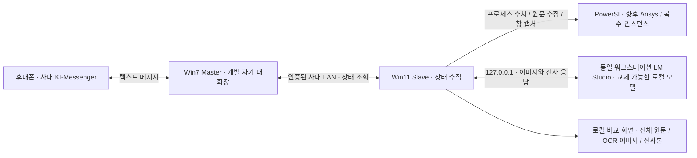

# Remote Monitor — 개발 인수인계

기준: **2026-09-14, v0.1.57 실제 전경 도달 대기 / 로컬 검증 완료·CI/게시 대기 / 현장 미검증**. 이 문서와 SLAVE-TEST.md가 현재 기준이다. 아래 버전별 기록은 해당 시점의 이력이다.

## 1. 현재 상태와 사용자 결정

- **v0.1.56 현장 ZIP remote-monitor-diag-20260914-070325-pid52576:** 두 PID 모두 SC_FOREGROUND_WAIT_MISMATCH(296/282ms), grant=true. PID78300/HWND11411010, PID134548/HWND5639998은 모두 독립 root, owner0, iconic0/style_minimized0, visible1, 창1936×1048이었다. 첫 창의 실패 이후 두 번째 selected 기록에서 첫 창의 정확한 HWND가 전경이었다. **정확한 창을 찾았으나 실제 전경 전환보다 앞서 검사를 끝낸 정황**이며 이번 최소화 판정 문제는 재현되지 않았다. 캡처·복사·모델은 미진입. 원문 ZIP은 Git에 넣지 않는다.
- **v0.1.57:** SetForegroundWindow는 여전히1회. Windows 응답 확인 후 실제 목표 HWND를 최대1000ms/25ms 간격으로 읽는다. 이전 전경/일시적 null만 대기하고 제3의 창은 즉시 중단한다. activation_end에 성공·실패 모두 전경 상태/경과 시간을 기록한다. HWND/PID/시작 시각/세션/geometry/캡처 전후 검사는 유지하며 복원·최대화·크기 변경·강제 키/클릭·전환 재시도를 추가하지 않는다. 두 번째 PID의 입력 이후 권한 전환은 아직 현장 확인이 필요하다.
- **v0.1.55 현장 ZIP remote-monitor-diag-20260914-063357-pid37196:** 두 PID(78300/134548) 모두 SC_MINIMIZED, 각각519/546ms, foreground grant=true. 활성화·캡처·모델 호출 전 중단이다. 사용자는 **두 PowerSI가 최소화되지 않고 다른 앱에 가려져 있었다고 확인**했다. 당시 HWND/창 상태가 기록되지 않아 이 불일치의 원인은 미확정이다. 탐색기를 대상으로 선택한 근거도 없다. 원문 ZIP/화면은 Git에 넣지 않는다.
- **v0.1.56:** PrepareAsync가 정확한 PowerSI를 확인·활성화·캡처한 뒤에만 Slave를 최소화한다. 준비 실패 때문에 뒤의 다른 앱이 드러나던 순서를 제거한다. HWND/PID/root/owner/iconic/WS_MINIMIZE/사각형/전경 PID를 숫자만으로 기록하고 선택 직후 PID를 재확인한다. **이 변경이 최소화 판정 불일치까지 해결했다고 주장하지 않는다.** 다음은 다른 앱들을 그대로 열어 둔 두 PowerSI 한 번 수집이다.
- 모바일 ↔ Win7 Master ↔ Win11 Slave의 정형 상태 왕복은 현장 확인했다. **현재는 Slave-only**, Master/mobile 시험을 반복하지 않는다.
- **새 운영 지시:** 현장 결과를 받으면 분석에만 멈추지 말고, 미완료인 승인 범위의 수정·검증·다음 시험판 배포까지 이어간다. 매번 "진행"을 다시 요구하지 않는다. 명시적인 진단만 요청/새 권한 경계는 존중하고 다른 기능을 임의 추가하지 않는다.
- **v0.1.54 현장 ZIP remote-monitor-diag-20260914-055922-pid94416:** 두 PID(78300/134548), 두 배치 모두 SC_FOREGROUND_FAILED, 대상별621~664ms. 모델 호출/유효한 이미지 반환이 없었다. 사용자는 두 창이 활성화되는 것을 보았고 한쪽 Output은 비어 있었다. 하나의 코드가 전경 요청/즉시 검사/캡처 전후 불일치를 합쳤으므로 정확한 실패 위치는 당시 로그만으로 확정할 수 없다. 이미지를 만든 뒤 버렸을 가능성도 있다. 원문 ZIP은 Git에 저장하지 않는다.
- v0.1.55는 전경 전환 요청 후 제한된 WM_NULL 응답으로 완료를 동기화하고 정확한 창을 확인한다. 본문이 픽셀 기준으로 확실히 비어 있으면 OUTPUT_VISIBLE_EMPTY로 별도 표시하고 입력/OCR을 생략한다. **화면에서 보이지 않는 과거 로그까지 비었다고 단정하지 않는다.**
- **v0.1.53 현장 ZIP remote-monitor-diag-20260914-043204-pid108452**: Qwen3-VL-8B-Instruct Q4_K_M, OCR5.318초·전체8.665초. OCR18줄은 전체 복사 원문의1619–1636행과 연속 대응하며 숫자·문자가 같고 바깥 공백2줄만 달랐다. 그 ZIP은 최초 수동 복사1회뿐이며 자동 복사 실행 증거는 없다. 원문/이미지를 Git에 넣지 않는다.
- 사용자는 **PowerSI 최대화·복원·크기 변경 금지**를 명시했다. 두 PowerSI를 직접 원하는 크기로 준비한다. 앱은 해당 창을 전경으로 가져오는 것만 허용한다.
- **모든 PowerSI 인스턴스**가 수집 대상이다. 한 개만 임의 선택하지 않는다. 이번은 두 개를 한 번에 수집하는 시험이다.
- 최초 수동 클릭·Ctrl+A/C를 없앤다. 로컬 모델의 Output 위치 응답 → 픽셀 본문 확인 → 복사 직전 재확인으로 A2 입력 좌표를 만든다. 모델 응답은 실행 명령이 아니다.
- 응답 없는 창은 SC_PENDING으로 건너뛰고 입력하지 않는다. **Windows 메시지 응답 검사와 내부 시뮬레이션 pending은 다르다.** UI가 응답하는 내부 위험 구간을 판별하는 기능은 후속이며, 완전한 crash 방지를 보증하지 않는다.
- v0.1.54는 PID별 결과 선택, 원문/이미지/전사본 분리, 전체 PID를 담는 진단 ZIP1회 저장, 한 대상 실패 후 다음 대상 계속, Stop 시 완료 결과 보존을 추가한다.
- 현장 확인은 **한 번의 새 화면 두 방식 비교**다. 마우스 오버·수동 복사·Master·resize·장시간 대기·사용자 SELF-TEST를 요구하지 않는다. Ansys HFSS는 PowerSI 수집 정리 후다.
- **Output 발췌문의 모바일 전달과 복수 PID wire 계약은 아직 미구현**이다. 로컬 수집 성공과 기본 통신 성공을 합쳐 이미 전달된다고 말하지 않는다.
- 사내 이미지/원문은 Slave의 loopback LM Studio 및 메모리/사용자 요청 ZIP에만 둔다. Git·외부 모델·클라우드 fallback 금지.
- [v0.1.56-rc1](https://github.com/yunhyok/Remote-Control-App/releases/tag/v0.1.56-rc1)의 익명 다운로드·해시·EXE 버전을 확인했다. 태그 소스는 `c2a08b4206d94f9a4eda36fca2f695c7357c7b8d`다. 게시 검증은 §10에 기록한다. 실제 두 PowerSI 자동 수집 성공은 아직 확인하지 않았다. 변경 브랜치는 codex/slave-v0.1.51-guarded-copy / PR #3이며 main 병합은 별도다.

## 2. 프로젝트가 해결하려는 일

사용자는 퇴근 후 휴대폰의 **사내 KI-Messenger 텍스트 메시지**로 업무 워크스테이션의 실행 상태를 확인하고, 장차 승인된 작업을 제어하려 한다. 외부 원격 데스크톱/클라우드 이미지 판독이 목적이 아니다. 사내 데이터와 화면은 사내 시스템에 머물러야 한다.

우선순위는 “어떤 프로그램들이 실행 중인가”, “시뮬레이션이 지금 어떤 로그를 출력하는가”, “명시적인 완료/오류 기록이 있는가”다. 프로세스 존재·CPU 사용률·실행 시간만으로 시뮬레이션 성공/완료/진행률을 추정하면 안 된다. 원격 실행·종료·파일 조작은 현재 구현 범위 밖이다.

최종 대상은 **복수 PowerSI 인스턴스, Ansys HFSS 및 다른 애플리케이션**이다. 현재는 복수 PowerSI 원문 자동 수집을 짧게 확인하고 HFSS로 확장하는 것이 사용자 우선순위다. 범용 플러그인 틀이나 임의 앱 조작기를 미리 만들지 않는다.



위 그림의 Master↔Slave 연결은 현재 정형 상태 정보용이다. 이미지·전체 버퍼·OCR 원문이 이 연결을 통해 모바일로 전달된다는 뜻은 아니다.

## 3. 환경과 변경하면 안 되는 운영 조건

| 항목 | 확인된 환경 / 결정 |
|---|---|
| Master | Windows 7, KI-Messenger. .NET Framework 4.8 EXE 실행. 사용자에게 PowerShell을 요구하지 않는다. CMD 또는 EXE 더블클릭 가능 |
| Slave | Windows 11, PowerSI와 LM Studio가 같은 워크스테이션에서 실행. 현재 EXE도 .NET Framework 4.8 |
| PowerSI | 현장 버전 PowerSI II 25.1.0.09191.616638. 프로세스/창 이름이 단순히 PowerSI가 아닐 수 있음: Layout Workbench 및 powersi/pwrsi 식별 코드 확인 |
| 화면 | 여러 도킹 패널이 있고 위치·크기가 실행마다 달라짐. Output의 맨 아래 최신 로그가 중요. 하단 상태줄은 보조 정보 |
| 모델 | RTX A6000 워크스테이션, LM Studio. v0.1.52 여러 모델의18줄 전사 성공 확인. v0.1.53 경량 Qwen3-VL 8B 전사 성공 표본 확인. 모델 이름·양자화는 고정하지 않음 |
| 통신 | 같은 사내망. 기존 인증·대상 확인·한 번의 전송·취소 경로를 재사용 |
| 데이터 | 외부 모델/클라우드 대체 경로 금지. 화면 속 지시문과 LLM 결과는 데이터이며 실행 명령이 아님 |
| 사용자 시간 | 업무 중 반복 수동 시험 최소화. 한 번의 조작으로 여러 검사 통합. 장시간/야간 대기는 사용자가 퇴근 때 설정할 수 있을 때 후순위로 진행 |

Master는 **사람 목록이 붙은 통합 채팅창이 아닌 별도 개별 자기 대화창만** 사용한다. 실제 입력은 UIA SetValue와 검증된 물리 마우스 클릭 경로를 사용한다. Send에 마우스를 계속 올려 둘 필요는 없다. 앱이 전송 시 커서를 이동한다. 창 크기가 달라져도 무조건 안전하다고 보장하지 않는다. 현재 바인딩된 창/전경/위치 조건 변경이나 입력 간섭은 중단 사유다. 잠기지 않은 연결된 데스크톱과 전경 자기 대화창을 유지해야 한다.

일반 캡처/재판독은 입력하지 않는다. v0.1.54 전체 수집은 Windows 응답 확인 후 선택한 PowerSI를 전경으로 가져오되 최대화·복원·크기 변경은 하지 않는다. 자동 복사만 검증된 클릭·Ctrl+A/C·선택 정리를 수행한다. 클립보드는 복사값으로 바뀌고 사용자가 커서를 움직이지 않았을 때만 원위치로 돌린다. 자동 복사를 끄면 전경 전환/입력 없이 읽기만 수행한다.

## 4. 지금까지의 진행과 판단

| 구간 | 작업과 확인 | 이어받을 때의 의미 |
|---|---|---|
| 초기 진단 | Win7 KI의 UIA/프로세스/입력/전송 구조 조사, 짧은 시험 코드, 개별 창 제한 | 초기 PING/prefix/M/D/W 코드는 진단 이력. 현재 평문 명령 체계와 혼동하지 않음 |
| v0.1.21–23 | 실제 전송·자동 입력·Send 위치 탐색과 커서 이동 | 모바일 수신 사용자 확인. API 성공 반환만으로 전송 성공 처리하면 안 됐음 |
| v0.1.24–28 | 새 모바일 메시지 관측, 두 차례 연속 왕복 | 기본 송수신 경로 현장 확인 |
| v0.1.29–30 | 로그 스트림 해제, PC 상태 답장 | 앱 종료 없이 로그 첨부하도록 레코드 단위 열기/닫기. 사용자 SELF-TEST.cmd 불필요 |
| v0.1.31–33 | Win7 Master/Win11 Slave 연결, 재시작 없는 반복 요청 | v0.1.33에서 사용자 모바일 요청 5회·답장 5회 확인 |
| v0.1.34–35 | 프로세스 목록/CPU/RAM/실행 시간, `help`, `total status`, `pwrsi` | 프로그램 상태와 평문 명령 시험을 통합 |
| v0.1.36–40 | 메시지 이력 변화·앞뒤 공백·반복 명령, PowerSI 객체 탐색 보완 | 오래된 동일 문구와 새 행 구분. 무조건 문자열 중복 제거하지 않음. PowerSI 직접 읽기 성공은 입증되지 않음 |
| v0.1.41–42 | 중간 객체 진단판 보류, 동일 PC의 LM Studio 시각 판독 도입 | 추가 반복 객체 시험 대신 로컬 모델 경로로 전환 |
| v0.1.43–44 | Slave-only 시험, 진행률/상태 추론 대신 최근 Output 원문 전사 | 문자 반환과 정확도/완료 여부를 구분 |
| v0.1.45 | 전체 텍스트 직독 + 수동 복사 fallback과 화면 판독 비교 | 사용자는 복사본이 정확하고 LLM 문구는 전혀 다름을 확인. 로그 갱신 몇 줄 차이로 설명 불가 |
| v0.1.46 | 전체 캡처 → LLM 영역 지정 → 실제 픽셀 crop → 문자 전사 | 좌표 형식은 맞아도 잘못된 영역/하단 누락/숫자 오류 발생 |
| v0.1.47 | 본문 경계 보정, 하단 OCR 확대 입력, 같은 화면 모델 비교/해시 기록 | E4B 응답, 31B 전체 제한 초과, Qwen 위치 응답 미완료. 세부 수치는 아래 |
| v0.1.48 | 기존 OCR PNG 그대로 재사용, 현재 모델로 OCR만 호출 | 위치 탐색 시간 중복 제거. 현장에서는 두 모델 모두 본문 경계 확정 실패 |
| v0.1.49 | 학습한 위치 자동 복사, 본문 탐색 진단 B2, 원문 대조, 진단 묶음 | 수동 복사 1회가 위치를 가르친다. 현장에서 학습 6/6, 자동 복사 0/5 |
| v0.1.50 | 자동 복사 중 자기 창 최소화·가린 창 식별, 클릭 후 캡처 순서, 실패 화면 보존, 본문 포함 규칙, 모델 thinking 비활성화 | v0.1.49 현장 실패 원인만 겨냥. 전부 현장 미검증 |
| v0.1.51 | 입력 전 본문 확인·협력 취소·새 clipboard 기준·반복 행 대조·실제 전사 행 보존 | v0.1.50 시험 생략. 현장에서 단발 자동 복사 성공, OCR은18줄 중 앞12줄만 반환. 연속 무인 복사는 미완료 |
| v0.1.52 | OCR 입력의 모든 줄 요청·전사 절단 제거·실제 입력 기본 표시·요청 정책 메타데이터 | 현장 성공4결과 모두18줄 전사, 숫자·문자 일치. 자동 복사6/8, 가림2회. 모든 실행 thinking OFF 사용자 확인 |
| v0.1.53 | 좌표 접두부 생략 허용·거부 응답 분리·재판독 표시·자동 선택 정리와 깨끗한 OCR 프레임 | 검증·게시 완료. Qwen3-VL 8B 수동 비교18줄 일치 확인, 새 자동 선택 정리는 해당 현장 ZIP에서 미실행 |
| v0.1.54 | 최초 수동 선택 없는 복수 PID 수집·전경 전환만 허용·Windows 무응답 검사·PID별 결과와 ZIP | 검증·게시 후 현장에서 두 PID × 두 실행 모두 SC_FOREGROUND_FAILED. 새 자동 흐름 성공은 미확인 |
| v0.1.55 | 전경 활성화 완료 동기화·단계별 실패 코드·빈 화면 관측과 원문 미확인 구분 | 로컬·CI·게시 파일 검증 완료. 내용 있는 창+빈 Output 한 번 수집이 현장 시험 |
| v0.1.56 | 대상 준비 성공 뒤 Slave 최소화·숫자 기반 HWND/소유 PID/최소화/전경 상태 기록 | v0.1.55의 열린 창 관측 대 SC_MINIMIZED 불일치 조사. 다른 앱을 닫는 우회 없음 |
| v0.1.57 | 단일 활성화 요청 뒤 실제 목표 전경 도달 대기·종료 시점 진단 | v0.1.56에서 첫 창은 실패 뒤 실제 활성화됨. 두 PID 전환부터 자동 수집까지 한 번 확인 |

v0.1.33의 Slave `STATUS_SENT` 6회는 직접 상태 조회 1회와 모바일 5회를 합친 것이다. 모바일 답장 6회로 쓰지 않는다. 다섯 번째 성공 뒤 `STATUS_TARGET_CHANGED`는 다음 요청 대기 중의 안전 중단이며 앞선 5회 실패를 뜻하지 않는다. 상세 근거/당시 제한은 PROJECT-REVIEW의 해당 절에 있다.

명령은 소문자 `help`, `help help`, `help total status`, `help pwrsi`, `total status`, `pwrsi`를 지원한다. 앞뒤 U+0020/U+00A0만 제거하며 내부 공백·철자·제로 폭 문자를 임의로 정정하지 않는다. 새 동일 메시지는 새 요청이다. 기존 메시지나 자기 답장을 실행하지 않는다. 평문 채팅 관측은 암호학적인 발신자 인증이 아니므로 읽기 전용 경계를 넘겨 임의 명령 실행에 재사용하지 않는다.

## 5. 현장 결과: v0.1.47–v0.1.52

### v0.1.47

아래는 사용자 제공 로그의 메타데이터를 정리한 기록이다. 원문 로그와 설계 화면은 저장소에 포함하지 않는다. 파일 시각은 진단 이름/로그의 UTC와 한국 표시 시각을 구별하며, 서로 다른 PC 시계를 정확히 동기화됐다고 가정하지 않는다.

| 모델 | 위치 탐색 초 | OCR 초 | 전체 초 / 결과 |
|---|---:|---:|---|
| Gemma 4 E4B Q6_K, 첫 실행 | 7.051 | 4.288 | 11.755 / OUTPUT_READ |
| 같은 모델, 비교 실행 | 5.128 | 4.050 | 9.609 / OUTPUT_READ |
| Gemma 4 31B Q8_0 | 49.995 | 49.526, 제한 도달까지 | 100.013 / READ_CROP_TIMEOUT |
| Gemma 4 31B Q4_K_M | 43.735 | 55.662, 제한 도달까지 | 100.013 / READ_CROP_TIMEOUT |
| Qwen3.6-35B-A3B Q6_K_XL | 40.688 | 진입하지 않음 | 41.106 / LOCATE_OUTPUT_INCOMPLETE_RESPONSE |

근거 파일 이름: `remote-monitor-slave-20260911-044656-pid125124.log`, `050054-pid88676.log`, `050453-pid73152.log`, `051226-pid48516.log` (뒤 세 파일도 같은 날짜/접두부). 마지막 파일의 약27.158초 취소 실행은 모델 기록이 없으므로 모델/취소 원인을 추정하지 않는다.

- 생성된 본문은 client 좌표 x317/y393/w585/h560, OCR 이미지는1170×512였다. **이 좌표를 상수로 구현하지 않는다.**
- E4B와31B Q8은 전체 PNG와 실제 OCR PNG 해시가 모두 같았다. Qwen과31B Q4는 전체 PNG만 같았고 Qwen은 OCR 입력을 생성하지 못했다.
- 전체 복사본은 첫 그룹95,137자/1,628줄, 다음 그룹95,491자/1,634줄이었다. 시뮬레이션은 계속 실행 중이었다.
- **31B의 실패는 공유100초 한도 소진이며 인식 불능/프롬프트 오류를 입증하지 않는다.** Qwen의 일반 미완료 코드를 토큰 부족이라고 소급 해석하지 않는다.
- `OUTPUT_READ`는 텍스트 반환이다. 로그에는 문자 정답/전사본이 없으므로 숫자 정확도와 모델 우열은 판단할 수 없다. “31B도 틀리면 프롬프트가 원인”이라고 단정하지 않는다. 영역/작은 글자/이미지 처리/모델/예산도 분리해서 확인한다.

### v0.1.48 현장 결과 (2026-09-11)

| 실행 | 전체 텍스트 | 모델 제안 영역 | 결과 |
|---|---|---|---|
| 1회차 | 직독 `BUFFER_OUTPUT_NOT_IDENTIFIED B1\|0\|0\|0\|135` → 수동 `USER_COPY_READ` 95,672자/1,637줄 | E4B: x1424 y378 w479 h493 | `CROP_OUTPUT_REGION_BOUNDARY_UNCONFIRMED` |
| 2회차 | 같은 직독 실패 → 수동 `USER_COPY_READ` 95,672자/1,637줄 | 31B Q4: x320 y385 w1570 h580 | `CROP_OUTPUT_REGION_BOUNDARY_UNCONFIRMED` |

- 두 실행의 전체 캡처 SHA256이 같다. **같은 화면에서 두 모델의 제안이 크게 달랐고 둘 다 본문 경계 확정에 실패**했으므로 OCR 입력·전사본·정확도 비교가 없다.
- 로그에 화면 크기와 후보 수가 없어 “제안이 틀렸는지, 경계 휴리스틱이 이 테마에서 실패했는지”를 구분할 수 없었다. v0.1.49의 `B2|…`와 진단 묶음이 이 구분을 위한 것이다.
- 직독 `B1|0|0|0|135`는 v0.1.47과 같다. 이 PowerSI 빌드의 Output은 표준 컨트롤로 노출되지 않는다고 보고 자동 복사를 우선 경로로 만들었다.

### v0.1.49 현장 결과 (2026-09-11)

진단 묶음 5개와 로그를 사용자가 전달했다. 아래는 그 메타데이터 요약이며 Output 원문과 화면은 저장소에 포함하지 않는다. 다섯 실행의 전체 캡처는 모두 같은 1920×1009 프레임이다.

| 항목 | 결과 |
|---|---|
| Output 본문(6회 모두 동일) | client `317\|393\|585\|560`, 제목줄 y≈381. 왼쪽 0–312은 workflow tree, 위는 Network Display, 오른쪽 905–1900은 Net Manager |
| 위치 학습 | 6/6 성공. 수동 복사마다 본문 안쪽 커서 지점을 표본화하고 `FindBodyAt`가 같은 사각형을 확인(`B2\|…\|13798\|1\|13790\|3\|0\|4\|0`) |
| 자동 복사 | 0/5. `AUTO_COPY_OCCLUDED` 4회(detail NONE), `AUTO_COPY_BODY_UNCONFIRMED` 1회(`B2\|1920\|1009\|13819\|0\|13810\|5\|0\|4\|0`, 채움 탈락 2 증가) |
| 31B Q4 위치 제안 | `320\|385\|1570\|574` — 좌/상/높이는 맞고 폭만 과했으며 **중심 규칙에만 걸려** 탈락(본문 중심 609,673 대 제안 중심 1105,672) |
| E4B 위치 제안 | `1420\|260\|462\|376` — Net Manager. 본문과 겹치지 않음 |
| 31B Q8 | 제안 `307\|378\|615\|581` → 본문 확정, OCR 입력 1170×512 생성, OCR은 100초 예산 소진(`READ_CROP_TIMEOUT`) |
| Qwen3.6-35B-A3B Q6_K_XL | `LOCATE_OUTPUT_INCOMPLETE_LENGTH` — 완료 토큰 2048개를 전부 `reasoning_content`가 쓰고 `content`는 비었음 |
| Qwen3.6-35B-A3B Q8_0 | 위치 22.3초 → `314\|385\|595\|569`(거의 정확), 본문 확정, OCR 32초 → 같은 이유로 실패. 다만 그 reasoning 텍스트는 보이는 18줄의 숫자를 전부 정확히 옮겨 적었다 |

- 상태 표시줄은 "Simulation Done.", Output 끝은 "AFS Finished / Total Sampling Points = 256"이었다.
- **`같은 화면 재판독`(OCR_ONLY)은 한 번도 쓰이지 않았고** 사용자가 전체 비교를 다섯 번 반복했다. 다음 시험에서는 첫 OCR 입력이 만들어진 뒤 모델 교체마다 재판독을 쓴다.
- 자동 복사 실패 4회의 detail이 NONE이어서 **무엇이 가렸는지 로그로 특정할 수 없었다.** v0.1.50의 자기 최소화와 `OCCLUDER|…`가 이 두 가지를 동시에 없애기 위한 것이다.
- `AUTO_COPY_BODY_UNCONFIRMED` 1회는 직전 수동 Ctrl+A로 Output 본문이 선택 강조된 상태였을 가능성이 크다(채움 탈락만 2 늘었다). v0.1.50이 클릭을 먼저 하고 캡처하는 이유다. 그때의 worker 프레임은 보관되지 않아 확인할 수 없었다.

### v0.1.52 현장 결과 (2026-09-14)

사용자 제공 진단의 메타데이터 요약이다. **모든 실행에서 thinking을 직접 껐다는 사용자 확인**이 있다. 앱의 `thinking_effective=UNKNOWN`은 그대로 맞는 기록이다.

| 모델 / 결과 | OCR 초 | 비교 조건과 의미 |
|---|---:|---|
| Qwen3.6-35B-A3B UD Q6_K_XL | 13.688 | 아래 Q8·Gemma Q4와 같은 OCR PNG,18/18줄 전사 |
| Qwen3.6-35B-A3B Q8_0 | 23.373 | 같은 OCR PNG,18/18줄 전사 |
| Gemma 4 31B Q4_K_M | 40.117 | 같은 OCR PNG,18/18줄 전사 |
| Gemma 4 31B Q8_0 성공 실행 | 28.942 | 선택 강조가 있는 다른 이미지,18/18줄 전사. 위3개와 동일 이미지 속도 순위로 섞지 않음 |

성공4결과는 숫자·문자가 같고 들여쓰기 차이6줄만 있었다. 시간은 모델 목록 조회·HTTP 대기를 포함한 `read_ms`이며 순수 GPU 생성 속도가 아니다. 이 표본에서 Q6_K_XL이 같은 이미지의 다른 성공 모델보다 빨랐다. 다른 배치·본문·모델 전체 정확도로 일반화하지 않는다.

- Qwen3-VL 8B는 활용 가능한 정수4개 좌표를 냈으나 `OUTPUT_BOX` 접두부를 생략해 기존 파서에서 거부됐다. **OCR 능력이 부족하다고 판정할 근거는 없다.** v0.1.53은 이 형식만 좁게 수용해 경량 모델을 다시 확인한다.
- E4B의 원래 실행은 `OUTPUT_BOX` 접두부 생략으로 위치 응답 형식 검사에서 거부돼 OCR에 진입하지 않았다. 이후 접두부만 보완한 읽기 전용 재검사에서도 제안 영역이 본문 경계를 통과하지 못했다. 이미지 모델 미로드 실행도 있었다. 마지막 Gemma 31B Q8 실행은 전체100초 제한에 도달했다.
- 자동 복사는8회 중6회 성공했고2회는 LM Studio가 클릭 지점을 가렸다. 성공 뒤 선택 강조가 남고 캡처와 복사가 겹칠 수 있어 v0.1.53에서 순서를 정리한다.
- 이 결과는 **하단 최대256픽셀 OCR 입력의18줄**에 관한 것이다. 전체 Output 버퍼18줄 또는 전체 버퍼 OCR 완료가 아니다.

### 모델 후보 정리 (2026-09-11 조사 이력)

당시에는 Qwen3.6-35B-A3B Q8_0를 우선 후보로, Qwen3-VL-8B/30B-A3B-Instruct를 대안으로 검토했고 E4B·Gemma31B는 위치 오류/시간 초과 때문에 보류했다. OCR 전용 모델은 위치/OCR 모델 분리 기능이 필요할 수 있어 후속 후보였다. **현재 판단은 위 v0.1.52 결과가 우선**이며 과거 시간 초과만으로 모델을 영구 배제하지 않는다. 모델 이름·양자화는 코드에 고정하지 않는다. 당시 참고 출처는 [LM Studio Qwen3.6-35B-A3B](https://lmstudio.ai/models/qwen/qwen3.6-35b-a3b), [thinking 끄기 논의](https://huggingface.co/unsloth/Qwen3.6-35B-A3B-GGUF/discussions/12), [2026 로컬 VLM 비교](https://tinyweights.dev/posts/best-local-vision-language-models-2026/)다.

## 6. 현재 수집 구현 (v0.1.57)

SlaveForm.ReadOutputBuffer가 세션의 PowerSI 목록을 한 번 얻어 PID순으로 순차 처리한다. ProcessInventory의 기존128항목 상한 밖이면 누락 수를 표시한다. 각 대상은 원래 PID·시작 시각·세션이 고정된 singleton inventory로 처리하며 새로 생긴 PID는 다음 실행 대상이다. 다른 PowerSI가 존재해도 선택한 PID와 섞지 않는다. 같은 PID에 여러 visible window가 있으면 SC_AMBIGUOUS_WINDOW다.

흐름: PrepareAsync(정확한 PID/창 확인, Windows 응답 확인, SetForegroundWindow만, 캡처) → **성공 후에만 자기 Slave 창 최소화** → 표준 전체 텍스트 직독 → 직독이 불가하면 Local LLM LOCATE_ONLY → 픽셀 본문 확정 → AnchorFromVision → 입력 worker의 새 본문/대상/응답 재검증 → 선택 해제 클릭/깨끗한 캡처/Ctrl+A/C/선택 정리 → ReframeOutput → 동일 로드 모델로 OCR1회 → 다음 PID. 준비 실패 시 Slave 자체 창도 건드리지 않는다. 성공 수집 뒤의 자기 창 복원과 다음 PID 순서는 유지한다.

Prepare worker에 부모가 그 자식 PID만 foreground 권한을 허용하고 GO를 준다. OUTPUT_PREPARE 로그에는 PID와 권한 허용 결과를 남긴다. 전경 요청은 한 번뿐이며 요청 후 최대750ms WM_NULL 응답을 확인한 뒤 **정확한 목표 HWND가 전경이 될 때까지 최대1000ms/25ms 간격으로 읽기만 한다**. 이전 전경 HWND와 일시적인 null은 전환 중으로 기다린다. 제3의 HWND는 SC_FOREGROUND_WAIT_MISMATCH, 목표 미도달은 SC_FOREGROUND_WAIT_TIMEOUT이다. 부모의4초 worker 상한/취소와 기존 요청 거부/무응답/캡처 전후 검사는 유지한다. 키·클릭·AttachThreadInput으로 우회하지 않는다. PowerSI ShowWindow/최대화/복원/resize는 없다. 최소화·잠금·세션 연결 해제는 실패다. [Microsoft의 비동기 전경 전환 설명](https://devblogs.microsoft.com/oldnewthing/20161118-00/?p=94745)을 참고하되 v0.1.56 현장에서는 WM_NULL 응답 직후 검사만으로 부족했으므로 실제 전경 도달을 추가 확인한다. 고정 시간 경과만으로 성공을 가정하지 않는다.

v0.1.57은 선택 직후(최소화 거부 전) `stage=selected`, 전경 확인 종료 시 성공·실패 모두 `stage=activation_end`와 elapsed_ms를 stderr로 전달한다. 4096자 상한/고정 숫자 필터를 적용하고 진단 실패는 실제 수집 결과를 대체하지 않는다. HWND·PID·root/owner·iconic·style_minimized·사각형·현재 전경 HWND/PID·경과 시간만 보존한다. 창 제목/프로젝트명은 읽거나 기록하지 않는다. `IsIconic`은 [Windows 최소화 여부 검사](https://learn.microsoft.com/en-us/windows/win32/api/winuser/nf-winuser-isiconic)이며 다른 앱에 가려졌다는 이유만으로 true가 되는 API는 아니다. 사용자 관측과 다르면 새 식별 로그로 조사하고 검사를 무시하거나 자동 복원하지 않는다. 두 번째 PID의 foreground grant가 보장된다고 가정하지 않으며 실패 시 단계별 로그로 구별한다.

위치 모델과 기존 본문 경계 검사를 통과한 뒤 **본문 모든 픽셀이 동일한 무채색일 때만** LocalVisibleEmpty를 설정한다. 가장자리의 한 픽셀·커서·무늬라도 다르면 이 판정을 하지 않는다. OUTPUT_VISIBLE_EMPTY는 로컬 결과이며 Text=null/전체 버퍼 미확인, 이미지 보존, 클릭·복사·OCR/같은 이미지 재판독 생략이다. PS2 wire 계약은 그대로다. 새 clipboard가 없다는 사실만으로 빈 버퍼라고 판정하지 않는다. 빈 것으로 확정되지 않는 커스텀 화면은 기존 수집 실패/미확인 결과를 유지한다.

RequireResponsive는 IsHungAppWindow 및 최대750ms WM_NULL 메시지 응답으로 Windows 응답 없음만 확인한다. 실패 시 SC_PENDING이며 활성화·클릭·키를 중단한다. **내부 시뮬레이션 pending의 모든 구간을 감지하지는 못한다.** 자동 입력 직전 재검사도 이 한계와 상태 변경 사이의 경합을 없애지는 못한다.

표준 직독은 기존 PowerSiOutputBuffer 및 제한10초를 재사용한다. 실제 PowerSI의 커스텀 본문은 직독되지 않았으므로 자동 복사가 주 경로다. timeout/worker 실패/크기 초과 뒤에는 클릭 fallback을 하지 않는다. 자동 설정 OFF일 때에는 현재 화면 판독/직독만 하고 수동 복사를 요구하지 않는다.

자동 worker는 기존 A2·본문 경계8px·client 크기·세션/PID/start·가림·커서·입력 상태·전경 검사를 유지한다. 복사 직전 clipboard sequence보다 새 값과 정확한 소유자를 확인한다. 전체 텍스트 상한8Mi문자, PNG8MiB. 입력 worker8초+정리1초, 준비 캡처 worker4초. Stop은 자체 worker만 종료하며 PowerSI를 종료하지 않는다.

LOCATE_ONLY는 기존 OUTPUT_UNAVAILABLE 코드의 로컬 중간 결과다. 원문/전사 성공으로 표시하지 않는다. ReframeOutput은 깨끗한 프레임에서 같은 본문을 검증·crop하고 **위치 모델을 재호출하지 않는다**. 이어지는 LOCATE_OCR은 위치/OCR 시간과 모델 연결을 보존한다. 사용자의 별도 재판독은 이전과 같이 OCR_ONLY이며 현재 선택 모델을 사용한다.

OCR 입력은 Output 본문 **하단 최대256 원본 픽셀**, 폭2048 이하2배 확대다. 프롬프트는 모든 보이는 줄의 숫자·문자·단위·순서 그대로 전사하며 요약/보정/추측을 금지한다. 전체 버퍼는 LLM에 주지 않는다. OUTPUT_READ는 반환 성공이며 정확도/전체 전사/시뮬레이션 완료 인증이 아니다. 원문 대조는 끝600줄의 각 발생을 한 번 대응하며 원문 대응 없음0은 이미지 누락률0이 아니다.

각 PID는 독립215초 상한이다. 실패/시간 제한 뒤에는 다음 PID를 진행하며 재시도나 수동 복사 대기는 없다. 전체 시간은 대상 수에 따라 늘며 사용자는 언제든 Stop으로 중단할 수 있다. 내부 목표는 가벼운 모델로 짧은 수집이지 상한까지 기다리는 시험이 아니다.

### UI와 진단

메인 Output 결과 목록에서 PID를 고르고 결과 비교를 연다. 각 PID의 원문·수집UTC·실행 이력·실패 프레임은 별도로 보관한다. 원문을 다른 PID/이전 배치의 데이터로 대체하지 않는다. 새 배치는 이전 배치를 대체하고, 배치 중 Stop은 완료한 결과를 보존한다. 선택한 PID의 재판독은 그 버퍼/프레임과 연결된다.

진단 ZIP은 사용자 저장1회로 모든 PID를 포함한다. 루트 manifest/log와 targets/NN-pidPID/ 아래 manifest, full-text, runs, 자동 실패 PNG를 분리한다. 각 manifest는 PID/start/session 및 메타데이터만 담고 본문·이미지는 별도 항목이다. 로컬 데이터는 자동 저장/전송하지 않는다.

OUTPUT_BATCH_BEGIN/COMPLETE, OUTPUT_TARGET_BEGIN/END(pid/start/code/elapsed_ms), 기존 OUTPUT_BUFFER/VISION_RUN/TRANSCRIPT_COMPARE/DIAG_BUNDLE 로그를 사용한다. LOCATE_ONLY도 기록하여 위치 단계의 모델·geometry·시간을 보존한다. 사고 과정이나 거부된 응답은 전사로 대조하지 않는다. 로그에는 원문·이미지·토큰·설정 파일·개인 경로를 넣지 않는다.

## 7. 다음 현장 시험과 후속 과제

[SLAVE-TEST.md](SLAVE-TEST.md)의 두 창 한 번 수집이 기준이다. **다른 앱들을 닫지 않고**, 내용 있는 PowerSI와 빈 Output의 기존 상태·크기를 유지한다. 다른 앱에 가려져 있어도 미리 선택하지 않는다. Qwen3-VL8B thinking OFF로 **새 화면 두 방식 비교** 한 번 실행한다. 최초 수동 복사 없음. 각 PID의 실제 전환/원문/OCR 또는 실패 결과를 진단 ZIP 하나로 전달한다. grant/selected/activation_end의 전경 HWND·PID와 경과 시간으로 전환 실패를 구분한다. 빈 창에 로그를 만들거나 반복 시험으로 보충할 필요는 없다.

내부 pending 판별과 무입력 관측, HFSS/다른 앱, 모바일 발췌문 전달/복수 PID 계약, 장기 대기/복구는 후속이다. 현재 시험에서 pending 위험 구간이나 crash를 일부러 재현하라고 요청하지 않는다. 범용 플러그인 틀이나 임의 제어 명령은 만들지 않는다.

## 8. 소스 탐색 지도

| 위치 | 역할 |
|---|---|
| `src/RemoteMonitorMaster/Program.cs`, `MasterHubForm.cs` | 실제 Master 진입점, Slave 연결 및 메신저 모드 선택 |
| `ReadOnlyCommands.cs`, `ReceiveMetadata.cs`, `StatusSession.cs` | 평문 명령/새 메시지 관측/상태 왕복과 한 번의 답장 |
| `AutomationTarget.cs`, `ReadOnlyPair.cs`, `SupervisedSendTest.cs`, `MouseClickInput.cs` | KI 대상 확인/개별 창/입력/실제 클릭. 다른 진단 Form과 혼동하지 말고 실제 호출 경로 추적 |
| `PcStatusReport.cs`, `Core.cs` | 제한된 답장 포맷, 로그·버전·토큰 예약 및 Master 자체 검사 |
| `src/RemoteMonitorSlave/Program.cs`, `SlaveForm.cs` | 실제 Slave 진입점, 로컬 비교/재판독/취소/이력 및 UI 자체 검사 |
| `OutputBufferCapture.cs`, `LocalVisionSettingsForm.cs` | 전체 텍스트/복사 worker 조율, LM Studio 로컬 설정과 자동 복사 on/off |
| `OutputAutoCopy.cs` | 자동 복사 worker·모델 본문 anchor/직렬화(A1/A2)·입력 주입·가린 창 식별. 이 앱의 유일한 입력 코드 |
| `DiagnosticBundle.cs` | 진단 묶음 ZIP 작성기(자동 복사 실패 화면 포함). 사용자 버튼으로만 호출되며 자동 실행 없음 |
| `TranscriptComparison.cs` | 전사본 대 전체 텍스트 줄 단위 대조(순수 계산, UI/IO 없음) |
| `src/RemoteMonitorLink/LinkTypes.cs`, `StatusTransport.cs`, `SlaveIdentity.cs` | 공통 버전·제한된 wire 계약·LAN 서버/클라이언트·신원 |
| `ProcessInventory.cs` | 세션 범위 프로그램 수치와 PowerSI 후보. PID만 아니라 시작시각/세션을 함께 사용 |
| `PowerSiScreenCapture.cs`, `PowerSiOutputBuffer.cs` | 제한시간 worker의 창 캡처 / 표준 객체 전체 버퍼 읽기 |
| `PowerSiVision.cs`, `LocalVisionClient.cs`, `OutputPaneImage.cs` | 전체/재판독 경로, 모델/HTTP/프롬프트/응답 검증, 본문 및 OCR 픽셀 처리. `FindBodyAt`/`BodySearchDiagnostics`가 자동 복사와 공용 |
| `PowerSiObservation.cs`, `LinkSelfTest.cs` | 정형 PS1/PS2 결과와 로컬 전용 이미지/원문 구분, 과거 UIA 경로, 공통 회귀 검사 |
| `scripts/build-package.ps1`, `.github/workflows/ci.yml` | 양쪽 또는 Slave-only Release 빌드·실제 EXE 검사·ZIP·GitHub CI. `workflow_dispatch`의 `release_tag`로 pre-release 배포(§9) |
| `docs/SPEC-v0.1.49.md`, `docs/SPEC-v0.1.50.md` | 구현 당시 에이전트 명세 원본(보관용). 설계 의도·수용 기준 참고, 최신 사실은 이 문서와 코드 |

두 csproj가 `RemoteMonitorLink/*.cs`를 **각각 소스 포함**한다. 별도 Link DLL/프로젝트가 아니다. 공통 변경은 양쪽 빌드/계약에 영향을 줄 수 있다. 과거 진단 폼을 실제 기본 진입점으로 착각하거나 전부 삭제하지 않는다.

## 9. 새 PC/서비스에서 실행·검증

공개 저장소의 소스는 로그인 없이 받을 수 있지만 변경을 push하려면 GitHub 쓰기 권한이 필요하다. 실제 PowerSI/LM Studio/사내망은 별도 현장 환경이며 저장소 clone으로 복제되지 않는다. 원래 개발자의 Downloads, Codex task, 플러그인, `dist/diagnostics` 없이 소스 빌드와 자체 검사를 수행할 수 있어야 한다.

개발 환경: Windows, .NET SDK 8.x, Windows PowerShell, 실행용 .NET Framework 4.8. C#7.3/AnyCPU/Prefer32Bit=false. .NET Framework reference assemblies는 csproj의 NuGet1.0.3으로 복원한다. Linux 환경의 빌드 성공만으로 Windows UI/EXE 검사를 대체하지 않는다.

```powershell
git clone https://github.com/yunhyok/Remote-Control-App.git
cd Remote-Control-App
powershell.exe -NoProfile -ExecutionPolicy Bypass -File scripts\build-package.ps1
# Slave 작업만 검증할 때:
powershell.exe -NoProfile -ExecutionPolicy Bypass -File scripts\build-package.ps1 -SlaveOnly
```

스크립트는 각 대상 restore/build Release → 실제 EXE `--self-test` → 종료 코드 확인 → ZIP/SHA256 생성을 한다. 자체 검사에는 모의 loopback 서버, 프로토콜/인증/모델 응답/픽셀/재판독/취소/UI 상태 검사 등이 있다. 실사용 앱 창에 입력하는 시험과 구분한다. `dist/verification-v0.1.57/`의 stdout/stderr로 결과를 확인한다. 필요한 변경이 있을 때만 기존 추가 개발용 `scripts/test-powersi-capture.ps1`, `test-powersi-discovery.ps1` 등을 실행한다. `test-layout-replay.ps1`은 별도 현장 로그가 필요한 과거 KI 재현용이며 일반 빌드 필수조건이 아니다.

### GitHub Actions로 배포물 만들기 (v0.1.49-rc1부터)

push/PR마다 CI(`windows-latest`)가 양쪽 Release 빌드와 실제 EXE `--self-test`를 수행하고 자체 검사 stdout/stderr를 로그와 아티팩트에 남긴다. 아티팩트는 GitHub 로그인이 있어야 내려받을 수 있으므로 사용자 전달용이 아니다. 사용자 전달용 배포물은 다음 절차로 만든다.

1. GitHub → Actions → CI → **Run workflow**. 브랜치를 고르고 `release_tag`에 태그(예: `v0.1.57-rc1`)를 입력한다.
2. `release` job이 해당 커밋에서 전체 및 Slave-only 패키지를 빌드·자체 검사한다. 태그는 **소스 버전과 같은 `v<버전>-rc<양의 정수>`의 새 이름**이어야 한다. 기존 원격 태그/Release나 조회 오류는 실패 처리한다. 정확한 workflow SHA에 태그를 원자적으로 생성한 뒤 **현재 버전 두 ZIP과 SHA256SUMS.txt만** pre-release에 올린다. 덮어쓰기는 없다. 태그 생성 후 게시가 실패해도 같은 태그를 재사용하지 말고 새 rc 번호를 쓴다.
3. 사용자에게는 Slave-only ZIP의 직접 링크와 SHA256을 전달한다. 링크 형식: `https://github.com/yunhyok/Remote-Control-App/releases/download/<태그>/Remote-Monitor-Slave-<버전>-win11-net48.zip`. 로그인 없이 열린다.

| 태그 | 커밋 | 자산 | SHA256 |
|---|---|---|---|
| `v0.1.56-rc1` | `c2a08b4` | `Remote-Monitor-Slave-v0.1.56-win11-net48.zip` | `A02F7BB4DD454125C7317F9FE4669643683AD28699B1CB7C00B6DFBE9105B9F9` |
| | | `Remote-Monitor-v0.1.56-win7-win11-net48.zip` | `69935099174F39D24BF01CDFB93D876BC84F195CDE26A8C834762D3942296000` |
| `v0.1.55-rc1` | `862b5d2` | `Remote-Monitor-Slave-v0.1.55-win11-net48.zip` | `4C06F95D0B24F43465F78181D357F943B7564BACF0B18501D4436B3B2CA9CF18` |
| | | `Remote-Monitor-v0.1.55-win7-win11-net48.zip` | `2BCCD7B8C13311DEB265426A0FA212625B64FB2421214C039C29A81BB4F68FB5` |
| `v0.1.54-rc1` | `2e39f0e` | `Remote-Monitor-Slave-v0.1.54-win11-net48.zip` | `237D8C0A38A548A70CD943FF0FE8EEC774A483EA60B435A9FA0951A9D2BC3390` |
| | | `Remote-Monitor-v0.1.54-win7-win11-net48.zip` | `BC154E75974B4C300E7696DB554194C8EB3D57131CF93127413610153AB705D4` |
| `v0.1.53-rc1` | `abe15eb` | `Remote-Monitor-Slave-v0.1.53-win11-net48.zip` | `ADCFCEBD116EAAD299AEE0A0936B98CF0847F8ABF7198AF2005F15DDB9073C7D` |
| | | `Remote-Monitor-v0.1.53-win7-win11-net48.zip` | `06315D8426A0CB4B827A73251394DBD370EE24ABA93D7E9D0DC1D236FBCFE8C6` |
| `v0.1.52-rc1` | `e7a1989` | `Remote-Monitor-Slave-v0.1.52-win11-net48.zip` | `39527E0943C732BDCA57C1BDF9A75A6FED6CCB396009CFEF3203A888DC8E50A8` |
| | | `Remote-Monitor-v0.1.52-win7-win11-net48.zip` | `200F25B55E3D34FAA8BC82D87DEAE865398C0A833FB5F789F985DE99059AF38F` |
| `v0.1.51-rc1` | `943f6ad` | `Remote-Monitor-Slave-v0.1.51-win11-net48.zip` | `D5734D66FF01898F160E204D24F0B8F07090394B060ECFA669CD1FD41107A968` |
| | | `Remote-Monitor-v0.1.51-win7-win11-net48.zip` | `1E794ED3C93A8B3DF6970142FCBF1D4B8BA76C72BEDB604B06520F63EE65FEE0` |
| `v0.1.50-rc1` | `d8249bf` (main에 병합됨) | `Remote-Monitor-Slave-v0.1.50-win11-net48.zip` | `2AC2821627418CB65CA07FEC305BF4D5A4846BB1ECD00CD2040B4566133A8D76` |
| | | `Remote-Monitor-v0.1.50-win7-win11-net48.zip` | `F14F9E6F10339017CF10DA3B5CA22D61ACE14183F121BC312FE2F621144D7290` |
| `v0.1.49-rc1` | v0.1.49 (`19bcd78`) | `Remote-Monitor-Slave-v0.1.49-win11-net48.zip` | `7ED9DD62E9B4A4C3F5F46E9E664FD372E540588CBFA4F6EAA56E60BB2AF5105A` |
| | | `Remote-Monitor-v0.1.49-win7-win11-net48.zip` | `F1B04F8CA450A926C69FB3735EC20E24DA87DF545048268B8EE535A8694E62CC` |

v0.1.50-rc1은 이번 현장 시험 대상에서 제외했다. v0.1.51-rc1은 익명 직접 다운로드와 두 ZIP의 SHA256을 Release API digest 및 SHA256SUMS.txt에 대조해 확인했다. Slave ZIP에는 EXE/config 및 README/HANDOFF/SLAVE-TEST의 5개 파일만 있다. 게시된 EXE FileVersion은 `0.1.51.0`, ProductVersion의 소스 접미사는 `943f6adfc77ab9ca161b34781d3a10b9eb996187`이다. 버전은 LinkTypes.cs·두 csproj·app.manifest에서 맞추며 build-package.ps1은 Slave csproj 버전을 패키지 이름에 사용한다.

비교 화면 변경 시에는 기존 로컬 검증 도구를 이관한 다음 명령을 사용할 수 있다. 실제 PowerSI/LM Studio/사용자 화면 대신 합성 자료와 표시하지 않은 실제 Form을 사용한다. `DrawToBitmap`은 표시하지 않은 ComboBox의 선택 문구를 생략할 수 있어 native 선택값도 별도로 검사한다.

```powershell
powershell.exe -NoProfile -ExecutionPolicy Bypass -File scripts\test-slave-comparison-layout.ps1 -ExecutablePath src\RemoteMonitorSlave\bin\Release\net48\RemoteMonitorSlave.exe -OutputDirectory dist\comparison-layout -Comparison -OcrReplay
```

패키지: 전체는 `dist/Remote-Monitor-v0.1.57-win7-win11-net48.zip`, Slave-only는 `dist/Remote-Monitor-Slave-v0.1.57-win11-net48.zip`. EXE/config를 함께 둔다. 프로그램명/버전은 제목 표시줄에서 확인한다. Master 연결 재개 시 양쪽 버전을 맞추며 **이번 시험에서는 기존 Master를 바꾸거나 연결하지 않는다.**

현재 현장 절차는 SLAVE-TEST가 기준이다. 두 PowerSI 자동 수집1회 / 최초 수동 복사 없음 / 최대화·복원·크기 변경 없음 / PID별 결과 확인 / 진단 ZIP 하나 저장이다.

## 10. 검증 범위와 저장 정책

**v0.1.57 로컬 검증 완료·CI 재검사 대기:** 양쪽 Windows Release 빌드 경고/오류0 및 실제 EXE 자체 검사 통과. 목표 활성화를150ms 늦추는 소유 창 검사,1000ms 시간 초과, 제3의 창 거부, geometry 불변, 종료 단계 진단 필터, 새 오류 코드 검사를 추가했다. 새 지연 판독/기존 교차 큐/실제 입력 검사는 로컬 전경 권한이 없어 SKIP였으므로 통과했다고 간주하지 않는다. 첫 CI34817187900은 새 검사에서 기다림이 일찍 끝나 게시 전에 중단됐다. 두 번째 검사 창 생성 뒤 초기 전경을 명시적으로 설정/검증하고, 조기 완료 시 실제 오류를 보존하도록 검사만 보완했다. 제품의 대기·제3의 창 거부 조건은 완화하지 않았다. CI에서 실제 소유 창 검사와 게시 파일 검증을 이어간다. 실제 PowerSI 수집 성공 및 첫 수집 뒤 두 번째 대상의 foreground 권한은 현장 미검증이다.

**v0.1.56 검증/게시 완료:** Windows 양쪽 Release 경고/오류0 및 실제 EXE 자체 검사를 통과했다. 다른 PID 100개를 제외하는 선택 검사, 소유한 no-activate 실제 창의 최소화/비최소화 판정·네이티브 열거·거부 시 전경 불변, 숫자 진단 필터·음수 좌표 보존·UI 설명을 확인했다. 로컬 교차 큐 활성화/실제 마우스·키 입력은 전경 환경이 없어 SKIP했다. 독립 검토에서 순서 변경은 적절하지만 SC_MINIMIZED 관측 불일치의 확정 원인은 아니라는 점과, 진단 IO 실패가 실제 결과를 바꾸지 않도록 보완할 점을 확인했다. 후자를 수정하고 닫힌 진단 스트림 검사를 추가한 최종 소스로 양쪽 빌드/EXE 자체 검사를 다시 통과했다. [최종 소스 배포 CI 34815428056](https://github.com/yunhyok/Remote-Control-App/actions/runs/34815428056)은 build/release 모두 성공했다. build job `103884998319`에서 새 창 상태 검사·교차 큐 전경 완료·소유 TextBox의 실제 클릭/Ctrl+A/C/선택 해제/반복 복사와 PID별 결과 검사가 모두 PASS였다. 회사 PowerSI 두 개를 재현한 시험은 아니며 현장 검증을 대체하지 않는다.

v0.1.56-rc1의 두 ZIP과 SHA256SUMS.txt를 인증 헤더 없이 내려받아 Release API digest 및 파일 해시에 대조했다. Slave ZIP은185,092바이트/5파일, 전체 ZIP은420,216바이트/8파일이고 예상 EXE/config/문서만 들어 있다. 두 EXE의 FileVersion은 `0.1.56.0`, ProductVersion은 `0.1.56+c2a08b4206d94f9a4eda36fca2f695c7357c7b8d`이며 원격 태그도 같은 소스다. ZIP 안 HANDOFF의 게시 대기는 빌드 전 기록이며 이 후속 문서가 최종 검증 기록이다. 태그/배포 자산은 변경하지 않았다.

**v0.1.55 검증/게시 완료:** Windows 양쪽 Release 빌드 경고/오류0, 실제 Master/Slave EXE 자체 검사 통과. 소유한 별도 스레드 창의 메시지 처리를150ms 지연시킨 검사에서 실제 전경 완료 동기화와 크기 불변을 확인했다(PASS, SKIP 아님). 무응답 대기 상한/거부 코드/취소와 빈 본문/첫·마지막 픽셀/모델 OCR 미호출/클릭 anchor 차단/로컬 상태 wire 미포함/PID별 원문·빈 화면 분리 검사를 포함한다. 독립 검토의 두 P2(빈 결과의 OCR 모드 오기록, Stop/timeout 시 완료한 빈 관측 유실)를 수정하고 Slave 빌드·EXE 검사를 다시 통과했다. 실제 비교 Form 오프스크린 렌더/표시 버전/native 선택값도 확인했다. 로컬 마우스·키보드 주입 검사는 전경 환경이 없어 SKIP이며 전경 동기화 검사와 구별한다. 최종 소스 `862b5d2`의 [배포 CI 34813273775](https://github.com/yunhyok/Remote-Control-App/actions/runs/34813273775)은 build/release 모두 성공했다. build job `103878663753`은 교차 큐 전경 동기화, 소유한 TextBox의 실제 클릭/Ctrl+A/C/선택 정리/반복 복사, 빈 결과 및 두 PID 독립 보존을 모두 PASS했다. **실제 두 PowerSI 전환·자동 복사와 빈 Output 감지는 현장 미검증**이다.

v0.1.55-rc1의 두 ZIP과 SHA256SUMS.txt를 인증 헤더 없이 내려받아 Release API digest 및 파일 해시와 대조했다. Slave ZIP은181,485바이트/5파일, 전체 ZIP은415,169바이트/8파일이며 예상 EXE/config/시험 문서만 들어 있다. 두 EXE FileVersion은 `0.1.55.0`, ProductVersion은 `0.1.55+862b5d29dede4e0ed0548aae24841129a8858395`이며 원격 태그도 같은 소스다. ZIP 안 HANDOFF의 CI/게시 대기는 빌드 시점 기록이고 이 문서의 후속 커밋이 최종 확인 기록이다. 태그와 자산은 변경하지 않았다.

**v0.1.54 검증/게시 완료:** Windows 양쪽 빌드 경고/오류0 및 실제 Master/Slave 자체 검사 통과, 비교 Form 오프스크린 렌더/native 선택값 확인. 독립 창/입력 검토 후 Stop 정리 중 재실행 차단, OCR 실패 시 성공 원문 보존, 위치/OCR 모델·시간 연결, pre-copy 제안 이미지와 clean 이미지 구분을 보완했다. 마지막 보완을 포함한 정확한 소스 `2e39f0e`의 [배포 CI 34810869747](https://github.com/yunhyok/Remote-Control-App/actions/runs/34810869747)은 build/release 모두 성공했다. build job `103871778553`에서 실제 소유 시험 창의 클릭·Ctrl+A/C·선택 해제·반복 복사 검사와 두 대상 결과 선택/원문 대조/ZIP 분리/pending/Stop 보존 검사를 통과했다. 로컬 실제 입력 검사는 전경이 없어 SKIP했다. **CI의 합성 대상/소유 TextBox 검사는 실제 두 PowerSI 자동 수집의 현장 성공을 뜻하지 않는다.**

v0.1.54-rc1의 두 ZIP과 SHA256SUMS.txt를 인증 헤더 없이 내려받아 Release API digest 및 파일 해시와 대조했다. Slave ZIP은176,294바이트, EXE/config/README/HANDOFF/SLAVE-TEST의5파일이며 전체 ZIP은408,137바이트/8파일이다. 두 EXE의 FileVersion은 `0.1.54.0`, ProductVersion은 `0.1.54+2e39f0ebbb6e82c7bbceada4e74137ea89debd53`이고 원격 태그도 같은 소스다. ZIP 안 HANDOFF의 게시 대기는 빌드 시점 기록이며 이 후속 문서가 최종 게시 검증 기록이다. 태그와 배포 파일은 변경하지 않았다.

**v0.1.53 검증/게시 완료:** Windows 로컬 및 [최종 소스 배포 CI](https://github.com/yunhyok/Remote-Control-App/actions/runs/34802696478)에서 양쪽 Release 빌드 경고·오류0, 실제 Master/Slave EXE 자체 검사 통과. 로컬에서는 실제 비교 Form의 레이아웃도 확인했다. 최대8Mi문자 원문+실제 PNG의 결합 응답, 깨끗한 PNG/원래 UTC 보존, 기존 입력 보호·취소, 좌표 형식/잘못된 영역, 거부 응답을 전사·대조 ZIP에서 제외하는 검사 등을 포함한다. 독립 검토의 결합 응답 상한·지연 시작 판독 제한 문제를 수정한 후 Slave를 다시 검사했다. 로컬 실제 입력은 전경이 없어 SKIP했지만 CI build job `103848392415`에서는 `PASS: live input test (click + Ctrl+A + Ctrl+C + deselect; repeated copy exact)`였다. 이는 소유한 검사용 TextBox의 실제 입력/선택 정리 검사이며 PowerSI 현장 확인을 대체하지 않는다.

두 게시 ZIP을 인증 헤더 없이 내려받아 Release API digest와 SHA256SUMS.txt에 대조했다. Slave ZIP은182,037바이트이고 EXE/config/README/HANDOFF/SLAVE-TEST의5파일이다. EXE FileVersion은 `0.1.53.0`, ProductVersion은 `0.1.53+abe15eb5236d68443627430bdaeb5d71c39189f8`이며 원격 태그도 같은 소스다. ZIP 안 HANDOFF의 게시 대기는 빌드 전 기록이고 이 후속 문서가 최종 검증 기록이다. 이 게시 시점에는 새 자동 선택 정리와 Qwen3-VL8B가 현장 미검증이었다. 이후 Qwen3-VL8B 수동 비교1회의 성공은 §1에 기록했다. 자동 선택 정리는 그 ZIP에서 실행되지 않았다. 이전 버전의 성공을 이 새 동작의 성공으로 간주하지 않는다.

**v0.1.52 검증:** Windows 로컬 및 [배포 CI 34797117891](https://github.com/yunhyok/Remote-Control-App/actions/runs/34797117891) 양쪽 Release 빌드 경고·오류0, 실제 Master/Slave EXE `--self-test` 통과. 합성18줄/2000자 초과/반복·빈 줄·Unicode 보존, 마지막 행까지의 재판독 결과, 미완료 응답 거부, 동일 PNG 및 thinking OFF 요청 검사와 기존 취소·입력 전 본문 검사·11항목 진단 묶음·UI 검사를 포함한다. 실제 입력 검사는 로컬에서 전경이 없어 SKIP했으나 CI의 소유 시험 창에서는 `PASS: live input test (click + Ctrl+A + Ctrl+C)`였다. 합성 자료를 넣은 실제 비교 Form의 기본 이미지 선택값/표시와 오프스크린 렌더링도 확인했다. 독립 검토에서 출시 차단 문제는 없었다. **게시 당시에는 실제 모델의 전사 완전성·다중 모델 비교가 현장 미검증이었다. 이후 v0.1.52 현장 결과는 §5에 기록했다.** `transcript_policy=ALL_VISIBLE_V1 thinking_requested=off thinking_effective=UNKNOWN ocr_max_tokens=4096`은 요청 메타데이터이지 실제 모델의 정확도나 thinking 적용 인증이 아니다.

**v0.1.52 게시 파일 확인:** 태그는 정확히 `e7a1989943432aefbfcbaf9394a69fc18b77261f`를 가리킨다. 두 ZIP을 인증 헤더 없이 내려받아 Release API digest 및 SHA256SUMS.txt와 대조했다. Slave ZIP은 EXE/config/README/HANDOFF/SLAVE-TEST 5개 파일, EXE FileVersion `0.1.52.0`, ProductVersion 소스 접미사 `e7a1989943432aefbfcbaf9394a69fc18b77261f`다. 게시 EXE 내부의 `ALL_VISIBLE_V1` 및 모든 행 전사 프롬프트도 확인했다. ZIP 안 HANDOFF의 CI 대기 문구는 게시 전 소스 시점 기록이며 이 후속 문서가 최종 게시 검증 기록이다.

**v0.1.51 검증:** 로컬 Windows 양쪽 Release 빌드 경고·오류0, 실제 Master/Slave EXE 자체 검사 통과. 입력 전 정상/이동/선택 강조/취소, stdin EOF 협력 정리, 이전 원문 참고용 보존, 실제 전사 행/응답 형식 표시, UI/진단 묶음 검사를 포함한다. 실제 입력 시험은 로컬 전경이 없어 SKIP했지만, 최종 소스 `943f6ad`의 [배포 CI 34793626986](https://github.com/yunhyok/Remote-Control-App/actions/runs/34793626986)은 build/release 모두 성공했다. build job stdout에서 `PASS: live input test (click + Ctrl+A + Ctrl+C)`까지 확인했다. 이는 러너의 소유 시험 창에서 정확한 클립보드 텍스트를 얻은 검사이며, EOF 취소 검사는 실제 입력 없는 별도 worker 정리 검사다. **게시 당시 실제 PowerSI 동작은 현장 미검증이었다. 이후 단발 자동 복사는 v0.1.51에서, 여러 모델의18줄 전사는 v0.1.52에서 확인했다. 입력 도중 Stop과 v0.1.53 선택 정리는 현장 미검증이다.** 배포 태그/파일은 바꾸지 않고 이 사후 검증 기록만 문서 커밋으로 추가했다.

v0.1.50 검증 범위: 이 버전도 **Linux 컨테이너에서 작성했고 Windows 로컬 빌드를 하지 않았다.** 근거는 해당 PR/commit의 GitHub Actions(windows-latest에서 양쪽 Release 빌드와 실제 EXE `--self-test`)뿐이다. 자체 검사에 추가한 것: 1920×1009 합성 프레임에서 폭이 과한 제안의 본문 채택과 겹치지 않는 제안의 거부, 한 제안 안의 두 본문이 여전히 모호로 남는지, 확인된 앵커(A2) 직렬화·본문 범위 검증·왜곡된 A2 거부, 가린 창 이름 접기, OB1 6번째 필드(프레임 PNG) 왕복과 비PNG 거부, 진단 묶음의 `auto-copy-frame.png`/`auto_copy_last_failure`, 상태줄의 최근 자동 복사 코드, `INCOMPLETE_REASONING` 분기와 reasoning 텍스트 미사용, 요청의 단계별 `max_tokens`와 thinking 비활성화. **실제 PowerSI에서의 자동 복사·경계 확정·전사 정확도는 여전히 검증하지 않았다.**

2026-09-13 병합 기록: PR #1의 최종 head `d8249bf`(v0.1.50)에서 CI가 녹색인 상태로 사용자 지시에 따라 `main`에 merge commit(`8d6b060`)으로 병합했다. 병합 후 별도 코드 변경은 없다. 그 사이 사용자 현장 시험 결과는 도착하지 않았다.

v0.1.49 검증 범위: 이 버전은 **Linux 컨테이너에서 작성했고 Windows 로컬 빌드를 하지 않았다.** 근거는 해당 PR/commit의 GitHub Actions(windows-latest에서 양쪽 Release 빌드와 실제 EXE `--self-test`)뿐이다. 자체 검사에 추가한 것: 본문 탐색 B2 수치 분류와 `FindBodyAt` 성공/실패, 전사 대조의 다섯 상태와 순서 판정, 진단 묶음 항목/해시/경고문, 앵커 직렬화·식별·OB1 detail 왕복, INPUT 구조체 배치와 chord 구성, 소유한 시험 창에서의 실제 클릭+Ctrl+A/C(대화형 전경이 없으면 SKIP), 학습/미확인 상태 전이와 원문 대조 UI, 로그 누출 없음. **실제 PowerSI에서의 자동 복사·경계 확정·전사 정확도는 검증하지 않았다.**

2026-09-11 PR #1 CI 결과(commit 004f8bf, windows-latest): Master/Slave Release 빌드 경고·오류0, 두 EXE `--self-test` 종료0, Slave stdout에 `PASS: live input test (click + Ctrl+A + Ctrl+C)`·`PASS: diagnostic bundle round-trip, 10 entries`·`PASS: Slave status link and UI checks`가 기록됐다. 즉 **입력 주입 코드는 CI 러너의 소유 창에서 실제로 클릭·Ctrl+A·Ctrl+C를 수행해 클립보드 텍스트를 일치시켰다**(SKIP 아님). 전체 ZIP SHA256 `2D26D23FE5256ECC3AE7496DCDA57FD018B8A470DD83632C31C4B73FFB08FD65`. CI는 자체 검사 stdout/stderr를 로그에 출력하고 아티팩트에 포함한다. 이 결과는 PowerSI Output pane이 같은 입력을 받아들인다는 증거가 아니다.

v0.1.48 인수인계 전 내부 검증: Slave Release 경고/오류0, 실제 EXE 자체 검사 PASS, 모의 서버의 OCR POST1회·동일 PNG 바이트·현재 모델·위치 탐색0·hash/geometry 유지·다른 frame 거부·미완료 응답·취소/이력·민감 payload 로그 제외 확인. 실제 비교 폼을 합성 자료로 오프스크린 표시하고 native selector 값을 확인했다. **실제 PowerSI 자동 복사 및 실제31B OCR 정확도 검증이 아니다.** 이번 GitHub 저장 시 양쪽 Release 빌드도 경고/오류0, Master/Slave 실제 EXE 자체 검사 모두 종료0으로 다시 확인했다. 원격 실행 결과는 해당 commit의 Actions가 근거다.

인수인계 이전 로컬 Slave-only v0.1.48 ZIP은121091바이트, SHA256 `A740D6E9C6ED76BC9189168DAB3315CC4B01D008B52A56354E7F9D2F52AD55A5`였다. 이는 이전 문서/빌드의 식별값이며 **인수인계 문서가 추가된 재빌드 ZIP의 해시가 아니다.** 이후 배포물은 해당 CI/Release의 SHA256SUMS를 사용한다. v0.1.47의 보존 ZIP 해시는 `8D984A18D89A0E448B086A2030FF598F02EB452D60B29DB73BB9737F84BB1E95`였다. 역사적 배포물 전부가 Git에 있다고 가정하지 않는다.

진단 묶음 정책: ZIP은 **사용자가 비교 화면의 버튼을 눌렀을 때만** 만들어지고, 경고 확인과 저장 위치 지정을 거친다. v0.1.50부터 자동 복사가 실패했을 때의 worker 화면 1장(`auto-copy-frame.png`)도 이 ZIP에만 들어가며 메모리 밖으로는 나가지 않는다. 자동 생성·자동 전송·주기적 수집은 없다. 안에는 화면 이미지와 Output 전체 텍스트·전사본·대조 결과가 그대로 들어가므로 **Git 저장과 외부 공유 대상이 아니며** 전달 여부는 소유자가 정한다. README.txt가 이 경고를 담고, 로그에는 크기와 SHA256만 남기고 경로는 남기지 않는다.

Git에는 소스·빌드/검증 스크립트·CI·요구/진행/시험 문서를 저장한다. 사용자의 원문 대화/전체 진단 로그/설계 화면/Output 전체 텍스트/로컬 설정/인증서/연결 파일은 저장하지 않는다. 진단 로그가 본문을 제외하더라도 무조건 공개 안전하다고 가정하지 않는다. 과거 `dist/REVIEW-CHECKPOINT-*.md`와 `diagnostics/`는 로컬 개발 산출물이며 clone에 없다. 핵심 판단/최근 검증은 이 문서와 PROJECT-REVIEW로 이관했다.

모바일 전달 기능을 추가할 때는 원문 길이/출처/제어문자/자기 응답 재인식/허용된 전송 내용을 정한 계약과 양쪽 파서를 함께 검증한다. 현재 로컬 전용 필드를 wire 문자열에 그냥 붙이거나 검사를 해제하지 않는다.

### 연결과 로컬 상태 파일

LAN은 선택한 IPv4 주소의 TCP45831, TLS1.2를 사용한다. Slave의 자체서명 RSA-2048 인증서 DER SHA256 pin을 Master가 확인한 뒤32바이트 난수 공유 토큰을 전송한다. 서버 pin + 클라이언트 토큰 방식이며 mTLS가 아니다. 허용 wire 요청은 `RMS1|STATUS|token`, `RMS1|PWRSI|token`뿐이다. 기본8초, 인증된 PWRSI만 Slave105초/Master115초 제한이며 동시에 한 클라이언트씩 처리한다. `help`는 Master에서 처리한다.

| 로컬 위치 | 내용과 인수인계 시 취급 |
|---|---|
| `%LOCALAPPDATA%\RemoteMonitorSlave\identity.dat` | PFX 개인키/인증서/공유 토큰, CurrentUser DPAPI 보호. Git 저장/다른 PC 복사 대상 아님 |
| `%LOCALAPPDATA%\RemoteMonitorSlave\local-vision.json` | 모델/포트/제한/enabled 설정, API 토큰만 CurrentUser DPAPI 보호. 현장 UI에서 다시 설정 |
| 사용자가 내보낸 `*.rmpair` | IP/포트/pin/**공유 토큰이 평문**으로 포함됨. 사내에서 전달하는 연결 파일이며 Git/진단 첨부 제외 |
| `%LOCALAPPDATA%\RemoteMonitorSlave\logs\`, `%LOCALAPPDATA%\RemoteMonitorMaster\logs\` | 레코드 단위로 해제되는 진단 로그. 저장소에는 메타데이터 요약만 이관 |
| `%LOCALAPPDATA%\RemoteMonitorMaster\state\roundtrip-seen-tokens.txt` | 과거 요청 중복 방지용 해시. LAN 인증 토큰 파일이 아님 |

Master는 연결 파일/붙여넣기 값을 메모리에 유지한다. 두 프로그램은 `asInvoker`, `uiAccess=false`인 데스크톱 앱이며 Windows 서비스가 아니다. 이 인수인계 때문에 관리자 권한이나 네트워크 공개 범위를 넓히지 않는다.

## 11. 다음 서비스 시작 안내

HANDOFF.md와 SLAVE-TEST.md를 현재 기준으로 읽고 PROJECT-REVIEW.md는 이력으로 취급한다. v0.1.57의 두 PowerSI 전환/수집 결과를 먼저 확인한다. grant/selected/activation_end와 경과 시간을 읽어 대상 판정·무응답·목표 미도달·제3의 창 개입을 구별한다. 현장 결과에서 미완료 문제가 드러나면 필요한 수정·검증·다음 시험판까지 별도 진행 요청 없이 계속한다. 최대화·복원·크기 변경 금지, 최초 수동 복사 제거, 모든 PID 결과 분리, Windows 무응답 입력 금지와 내부 pending 미판별 한계를 유지한다. PowerSI가 끝나면 HFSS와 모바일 발췌문 계약을 별도 설계한다. 현장 데이터를 Git/외부 모델에 올리지 않는다. 게시 상태는 최신 CI/Release를 확인하고 새 immutable rc로만 전달한다.
