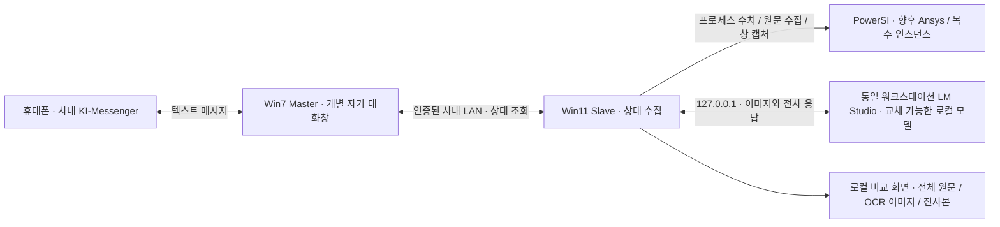
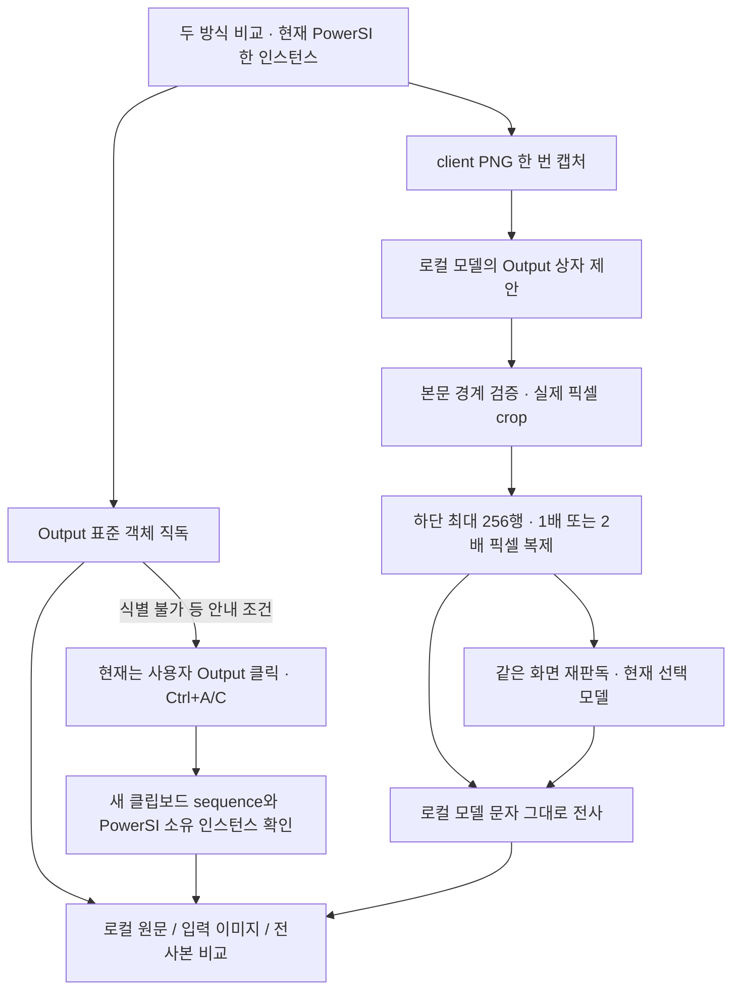

# Remote Monitor — 다른 개발 에이전트를 위한 인수인계

기준: **2026-09-11, v0.1.48**. Claude 등 다른 서비스가 원래 대화를 읽지 않아도 이어서 작업하기 위한 문서다. 저장소는 `yunhyok/Remote-Control-App`이며 사용자 승인에 따라 **Public으로 전환했다.** 개발을 처음부터 재시작하지 않는다.

## 1. 지금 이어받을 상태

- **모바일 ↔ Win7 Master ↔ Win11 Slave의 읽기 전용 상태 왕복은 현장에서 확인했다.** 같은 마우스 오버·전송·기본 왕복 시험을 다시 요구하지 않는다.
- 현재 현장 시험은 **Slave만** 사용한다. PowerSI Output의 정확한 원문 확보와 Local LLM 문자 판독을 비교하는 단계다. Master·메신저·모바일은 이번 시험에서 제외한다.
- v0.1.48은 **이미 확보한 동일 OCR PNG를 다른 모델로 재판독**한다. 기존 31B 시험에서 위치 찾기가 전체 제한 시간을 소모했던 문제를 줄였다. 코드/모의 서버 검사는 통과했으나 **v0.1.48의 새 현장 결과는 아직 없다.**
- **자동 Output 클릭 → Ctrl+A → Ctrl+C는 아직 구현되지 않았다.** 표준 객체 직독은 구현되어 있으나 실제 PowerSI에서 식별되지 않아 사용자가 수동 복사했다. 자동 복사는 사용자가 명시적으로 요구한 다음 작업이다.
- 최신 OCR 발췌문과 전체 복사본은 **Slave의 메모리/비교 화면에만** 있다. **Output 발췌문을 메신저로 보내는 연결도 아직 미구현**이다. 통신 성공과 이 기능 완료를 혼동하지 않는다.
- 목적은 로그를 정확하게 전달하는 것이다. PowerSI에는 신뢰할 만한 진행률 표시가 없으므로 **진행률 %를 만들지 않는다.**

읽는 순서: 이 문서 → [현재 사용자 시험 안내](SLAVE-TEST.md) → [현재 동작 상세](README.md) → 관련 소스. [PROJECT-REVIEW.md](PROJECT-REVIEW.md)는 v0.1.33부터의 **시점별 기록**이며 앞부분의 “현재/미구현”을 최신 사실로 읽지 않는다. [WIN7-TEST.md](WIN7-TEST.md)는 통신 개발을 재개할 때 참고한다.

## 2. 프로젝트가 해결하려는 일

사용자는 퇴근 후 휴대폰의 **사내 KI-Messenger 텍스트 메시지**로 업무 워크스테이션의 실행 상태를 확인하고, 장차 승인된 작업을 제어하려 한다. 외부 원격 데스크톱/클라우드 이미지 판독이 목적이 아니다. 사내 데이터와 화면은 사내 시스템에 머물러야 한다.

우선순위는 “어떤 프로그램들이 실행 중인가”, “시뮬레이션이 지금 어떤 로그를 출력하는가”, “명시적인 완료/오류 기록이 있는가”다. 프로세스 존재·CPU 사용률·실행 시간만으로 시뮬레이션 성공/완료/진행률을 추정하면 안 된다. 원격 실행·종료·파일 조작은 현재 구현 범위 밖이다.

최종 대상은 **복수 PowerSI 인스턴스, Ansys 및 다른 애플리케이션**이다. 단일 PowerSI 창 제한은 현재 수집 방식 검증을 위한 임시 조건이며 최종 요구사항이 아니다. 다만 지금 범용 플러그인 틀이나 임의 앱 조작기를 새로 만들 필요는 없다.



위 그림의 Master↔Slave 연결은 현재 정형 상태 정보용이다. 이미지·전체 버퍼·OCR 원문이 이 연결을 통해 모바일로 전달된다는 뜻은 아니다.

## 3. 환경과 변경하면 안 되는 운영 조건

| 항목 | 확인된 환경 / 결정 |
|---|---|
| Master | Windows 7, KI-Messenger. .NET Framework 4.8 EXE 실행. 사용자에게 PowerShell을 요구하지 않는다. CMD 또는 EXE 더블클릭 가능 |
| Slave | Windows 11, PowerSI와 LM Studio가 같은 워크스테이션에서 실행. 현재 EXE도 .NET Framework 4.8 |
| PowerSI | 현장 버전 PowerSI II 25.1.0.09191.616638. 프로세스/창 이름이 단순히 PowerSI가 아닐 수 있음: Layout Workbench 및 powersi/pwrsi 식별 코드 확인 |
| 화면 | 여러 도킹 패널이 있고 위치·크기가 실행마다 달라짐. Output의 맨 아래 최신 로그가 중요. 하단 상태줄은 보조 정보 |
| 모델 | RTX A6000 워크스테이션, LM Studio. 경량 Gemma 4 E4B와 31B/Qwen을 비교 중. 모델 이름·양자화를 고정하지 않음 |
| 통신 | 같은 사내망. 기존 인증·대상 확인·한 번의 전송·취소 경로를 재사용 |
| 데이터 | 외부 모델/클라우드 대체 경로 금지. 화면 속 지시문과 LLM 결과는 데이터이며 실행 명령이 아님 |
| 사용자 시간 | 업무 중 반복 수동 시험 최소화. 한 번의 조작으로 여러 검사 통합. 장시간/야간 대기는 사용자가 퇴근 때 설정할 수 있을 때 후순위로 진행 |

Master는 **사람 목록이 붙은 통합 채팅창이 아닌 별도 개별 자기 대화창만** 사용한다. 실제 입력은 UIA SetValue와 검증된 물리 마우스 클릭 경로를 사용한다. Send에 마우스를 계속 올려 둘 필요는 없다. 앱이 전송 시 커서를 이동한다. 창 크기가 달라져도 무조건 안전하다고 보장하지 않는다. 현재 바인딩된 창/전경/위치 조건 변경이나 입력 간섭은 중단 사유다. 잠기지 않은 연결된 데스크톱과 전경 자기 대화창을 유지해야 한다.

Slave의 현재 캡처/판독은 창 활성화나 키보드·마우스 입력을 하지 않는다. 사용자 수동 Ctrl+C는 일반 클립보드를 변경한다. 향후 자동 복사는 별도의 짧은 입력 동작이므로 현재의 무입력 성질을 그대로 주장할 수 없다.

## 4. 지금까지의 진행과 판단

| 구간 | 작업과 확인 | 이어받을 때의 의미 |
|---|---|---|
| 초기 진단 | Win7 KI의 UIA/프로세스/입력/전송 구조 조사, 짧은 시험 코드, 개별 창 제한 | 초기 PING/prefix/M/D/W 코드는 진단 이력. 현재 평문 명령 체계와 혼동하지 않음 |
| v0.1.21–23 | 실제 전송·자동 입력·Send 위치 탐색과 커서 이동 | 모바일 수신 사용자 확인. API 성공 반환만으로 전송 성공 처리하면 안 됐음 |
| v0.1.24–28 | 새 모바일 메시지 관측, 두 차례 연속 왕복 | 기본 송수신 경로 현장 확인 |
| v0.1.29–30 | 로그 스트림 해제, PC 상태 답장 | 앱 종료 없이 로그 첨부하도록 레코드 단위 열기/닫기. 사용자 SELF-TEST.cmd 불필요 |
| v0.1.31–33 | Win7 Master/Win11 Slave 연결, 재시작 없는 반복 요청 | v0.1.33에서 사용자 모바일 요청 5회·답장 5회 확인 |
| v0.1.34–35 | 프로세스 목록/CPU/RAM/실행 시간, `help`, `total status`, `pwrsi` | 프로그램 상태와 평문 명령 시험을 통합 |
| v0.1.36–40 | 메시지 이력 변화·앞뒤 공백·반복 명령, PowerSI 객체 탐색 보완 | 오래된 동일 문구와 새 행 구분. 무조건 문자열 중복 제거하지 않음. PowerSI 직접 읽기 성공은 입증되지 않음 |
| v0.1.41–42 | 중간 객체 진단판 보류, 동일 PC의 LM Studio 시각 판독 도입 | 추가 반복 객체 시험 대신 로컬 모델 경로로 전환 |
| v0.1.43–44 | Slave-only 시험, 진행률/상태 추론 대신 최근 Output 원문 전사 | 문자 반환과 정확도/완료 여부를 구분 |
| v0.1.45 | 전체 텍스트 직독 + 수동 복사 fallback과 화면 판독 비교 | 사용자는 복사본이 정확하고 LLM 문구는 전혀 다름을 확인. 로그 갱신 몇 줄 차이로 설명 불가 |
| v0.1.46 | 전체 캡처 → LLM 영역 지정 → 실제 픽셀 crop → 문자 전사 | 좌표 형식은 맞아도 잘못된 영역/하단 누락/숫자 오류 발생 |
| v0.1.47 | 본문 경계 보정, 하단 OCR 확대 입력, 같은 화면 모델 비교/해시 기록 | E4B 응답, 31B 전체 제한 초과, Qwen 위치 응답 미완료. 세부 수치는 아래 |
| v0.1.48 | 기존 OCR PNG 그대로 재사용, 현재 모델로 OCR만 호출 | 위치 탐색 시간 중복 제거. 코드 검증 완료, 현장 정확도 비교 대기 |

v0.1.33의 Slave `STATUS_SENT` 6회는 직접 상태 조회 1회와 모바일 5회를 합친 것이다. 모바일 답장 6회로 쓰지 않는다. 다섯 번째 성공 뒤 `STATUS_TARGET_CHANGED`는 다음 요청 대기 중의 안전 중단이며 앞선 5회 실패를 뜻하지 않는다. 상세 근거/당시 제한은 PROJECT-REVIEW의 해당 절에 있다.

명령은 소문자 `help`, `help help`, `help total status`, `help pwrsi`, `total status`, `pwrsi`를 지원한다. 앞뒤 U+0020/U+00A0만 제거하며 내부 공백·철자·제로 폭 문자를 임의로 정정하지 않는다. 새 동일 메시지는 새 요청이다. 기존 메시지나 자기 답장을 실행하지 않는다. 평문 채팅 관측은 암호학적인 발신자 인증이 아니므로 읽기 전용 경계를 넘겨 임의 명령 실행에 재사용하지 않는다.

## 5. 최신 현장 결과: v0.1.47

아래는 사용자 제공 로그의 메타데이터를 정리한 기록이다. 원문 로그와 설계 화면은 저장소에 포함하지 않는다. 파일 시각은 진단 이름/로그의 UTC와 한국 표시 시각을 구별하며, 서로 다른 PC 시계를 정확히 동기화됐다고 가정하지 않는다.

| 모델 | 위치 탐색 초 | OCR 초 | 전체 초 / 결과 |
|---|---:|---:|---|
| Gemma 4 E4B Q6_K, 첫 실행 | 7.051 | 4.288 | 11.755 / OUTPUT_READ |
| 같은 모델, 비교 실행 | 5.128 | 4.050 | 9.609 / OUTPUT_READ |
| Gemma 4 31B Q8_0 | 49.995 | 49.526, 제한 도달까지 | 100.013 / READ_CROP_TIMEOUT |
| Gemma 4 31B Q4_K_M | 43.735 | 55.662, 제한 도달까지 | 100.013 / READ_CROP_TIMEOUT |
| Qwen3.6-35B-A3B Q6_K_XL | 40.688 | 진입하지 않음 | 41.106 / LOCATE_OUTPUT_INCOMPLETE_RESPONSE |

근거 파일 이름: `remote-monitor-slave-20260911-044656-pid125124.log`, `050054-pid88676.log`, `050453-pid73152.log`, `051226-pid48516.log` (뒤 세 파일도 같은 날짜/접두부). 마지막 파일의 약27.158초 취소 실행은 모델 기록이 없으므로 모델/취소 원인을 추정하지 않는다.

- 생성된 본문은 client 좌표 x317/y393/w585/h560, OCR 이미지는1170×512였다. **이 좌표를 상수로 구현하지 않는다.**
- E4B와31B Q8은 전체 PNG와 실제 OCR PNG 해시가 모두 같았다. Qwen과31B Q4는 전체 PNG만 같았고 Qwen은 OCR 입력을 생성하지 못했다.
- 전체 복사본은 첫 그룹95,137자/1,628줄, 다음 그룹95,491자/1,634줄이었다. 시뮬레이션은 계속 실행 중이었다.
- **31B의 실패는 공유100초 한도 소진이며 인식 불능/프롬프트 오류를 입증하지 않는다.** Qwen의 일반 미완료 코드를 토큰 부족이라고 소급 해석하지 않는다.
- `OUTPUT_READ`는 텍스트 반환이다. 로그에는 문자 정답/전사본이 없으므로 숫자 정확도와 모델 우열은 판단할 수 없다. “31B도 틀리면 프롬프트가 원인”이라고 단정하지 않는다. 영역/작은 글자/이미지 처리/모델/예산도 분리해서 확인한다.

## 6. 현재 수집·판독 구현



### 전체 텍스트

`PowerSiOutputBuffer`는 Output native 컨테이너 또는 UIA non-root HWND와 연결되는 **유일한 표준 multiline Edit/RichEdit**를 찾아 WM_GETTEXT로 읽는다. 한도8Mi UTF-16문자; RichEdit의64K 초과 직독 제한, 숨김/비밀번호/모호성/길이 변화 등은 구분해 실패 처리한다. 출력 중 같은 길이 갱신까지 원자성을 보장하지는 않는다.

실제 PowerSI에서 `B1|0|0|0|135`가 관측됐다. 이는 native 객체0/Output 범위0/표준 본문 후보0/UIA 방문135이며, “화면에 객체가 전혀 없다”는 뜻은 아니다. 직독 성공이 아니라 수동 복사로 원문을 얻었다.

`OutputBufferCapture`는 작업 시작 뒤 새 clipboard sequence, 동일 PID·시작시각·세션·소유자를 검사한다. **같은 프로세스에서 복사했다는 사실만으로 Output 전체 선택을 입증할 수 없다.** 복사 대기30초/직독 worker10초/클립보드 읽기 worker3초를 사용한다. PowerSI가 버린 이전 로그는 복원할 수 없다.

### 이미지·모델

`PowerSiScreenCapture`는 대상 프로세스/세션/단일 창/데스크톱 조건을 확인하고 별도 단발 worker에서 client PNG를 얻는다. 전체 데스크톱 대체 캡처나 활성화는 없다. 캡처 worker 약4초, 최대4096픽셀 크기 및8MiB PNG 경계가 있다.

`LocalVisionClient`는 LM Studio 0.4+의 `/api/v1/models`에서 로드 인스턴스와 `capabilities.vision`을 확인한다. `/v1/chat/completions`의 이미지 요청을 사용한다. `http://127.0.0.1:<port>`만 사용하며 프록시·리다이렉트·클라우드 fallback·자동 모델 관리가 없다. LM Studio 자체도 같은 PC의 로컬 모델로 설정해야 한다. 앱이 서버 내부의 원격 중계 여부를 보장하지는 못한다.

위치 요청과 OCR 요청은 분리된다. `OUTPUT_BOX left top right bottom`의0~1000 정규화 좌표를 실제 픽셀로 변환하고 범위/방향/전체 화면 지정 등을 검사한다. `OutputPaneImage`는 제안 중심·겹침과 평평한 중립색 배경 연결 영역으로 본문 경계를 보정한다. 이것은 **현재 테마에서 검증하는 임시 휴리스틱**이며 올바른 사각형만으로 의미상 Output 식별을 보증하지 않는다. 후보가 불명확하면 원래 제안 상자로 OCR을 강행하지 않는다.

전체 본문 preview와 OCR 실제 입력을 구분한다. OCR은 본문 하단 최대256 원본 픽셀 행이며 폭2048 이하에서는 최근접2배, 더 넓으면1배다. 생성형 이미지 편집이나 문자 수정이 아니다. 요청은 문자/숫자/단위/순서 그대로, 요약·의역·보정·가려진 문자 추측 금지다. 최대12줄/2000자의 최근 발췌를 표시한다. 모델이 지시를 따른다고 가정하지 않는다.

v0.1.48 `PowerSiVision.CaptureAsync(... savedFrame, savedCrop)`는 실제 OCR 입력이 있으면 **바이트 그대로 재사용**하고 위치 찾기·재crop을 생략한다. 동일 frame 객체와 crop의 연결을 검사한다. `OCR_ONLY`의 위치 메타데이터는 이전 모델이 만든 것을 물려받은 것이며 현재 모델의 위치 능력 평가가 아니다. 입력이 없으면 저장한 전체 화면으로 기존 경로를 수행한다.

모델 호출 제한15~90초(기본60), 전체 판독100초/바깥 실행105초. 재판독의31B에는90초를 설정해 위치 탐색 없이 OCR에 사용한다. 온전하지 않은 응답, 도구 호출, 거부, 잘못된 형식은 거부한다. v0.1.48은 명시적 `finish_reason=length`를 `INCOMPLETE_LENGTH`로 구분한다. 자동 재시도는 없다.

### UI·로그

비교 화면 왼쪽은 전체 복사 원문, 오른쪽은 실행별 이미지/전사본이다. 네 이미지 선택은 전체 본문, 하단 OCR 입력, LLM 제안 영역, PowerSI 원본이다. 최근8회 이력은 메모리에만 남는다. 모델 교체 때 **비교 창만 닫는다**. 재판독 중 Stop은 이전 완료 결과를 보존하지만 **대기 중 Stop은 이력을 비운다**. 취소/늦은 callback이 새 결과를 덮어쓰지 않도록 검사한다.

`VISION_RUN`은 모델 ID/이름/키/양자화, 전체 `sample`과 실제 `ocr_sample` SHA256, `mode`, `crop_reused`, `request_timeout_s`, `total_ms/locate_ms/read_ms`, `geometry=P2|제안x|y|w|h|본문x|y|w|h|OCR폭|높이`를 기록한다. 미확인 필드는 UNKNOWN. OCR-only면 locate_ms=0이다. read_ms에는 모델 목록/HTTP 대기도 포함되어 순수 GPU 속도가 아니다.

이미지·전체 버퍼·전사본·거부된 응답·프롬프트·토큰은 진단 로그/기존 상태 프로토콜에 넣지 않는다. 거부된 응답 preview도 UNVALIDATED이며 제한된 길이로 로컬 표시만 한다. 원문 수집과 캡처는 시각이 다를 수 있지만 **동일 OCR 이미지와 전사본의 차이를 실행 중 로그 갱신 탓으로 돌릴 수 없다.**

## 7. 다음 구현: 자동 Ctrl+A/C

가능성을 검토하는 데서 끝내지 말고, 기존 직접 읽기와 시각 판독을 유지하면서 **현재 Output을 확인한 뒤 한 번 자동 복사**하는 경로를 구현하는 것이 다음 우선 과제다. 아직 동작한다고 보고하지 않는다.

재사용할 부분:

- `PowerSiScreenCapture.ResolveWindow`: 프로세스 인스턴스/세션/단일 창 확인.
- `OutputPaneImage`: 본문 후보. 좌표 형식 검증은 실제 의미/클릭 대상 검증의 대체가 아님.
- `OutputBufferCapture`: 새 클립보드와 소유 인스턴스 검사.
- Master `MouseClickInput` 및 전송 경로: 취소/입력 간섭/실제 클릭 검사 패턴 참고. 메신저 전용 코드를 Slave에 통째로 연결하지 않음.

현재 `PowerSiFrame` worker 계약은 PNG·크기·캡처 시각만 가진다. 라이브 입력 전에는 **HWND/PID/프로세스 시작시각/세션/client-to-screen 변환과 현재 창·본문**을 연결해 재검증할 정보가 필요하다. 창 이동/resize/DPI/겹친 창/전경 전환/프로세스 재시작을 예전 좌표로 클릭하면 안 된다. **저장 이미지 재판독은 절대로 예전 좌표로 클릭하거나 복사하지 않는다.**

구현 순서: 직접 읽기 → 필요 시 현재 화면에서 Output 식별·검증 → 본문 focus/click → Ctrl+A/C 한 번 → 새 동일 인스턴스 클립보드 확인 → 기존 비교 화면. 대상이 모호하거나 사용자의 입력/전경 변경이 끼면 중단한다. 다른 패널/오래된 clipboard를 성공으로 채택하지 않는다. 보통의 복사는 clipboard를 바꾸며 나중의 사용자 복사본을 덮어쓰는 복원은 하지 않는다.

먼저 소유한 시험창에서 성공/잘못된 pane/창 이동/취소/오래된 clipboard/다른 프로세스 복사 등을 묶어 검사한다. 그 다음 **한 번의 Slave 현장 시험**에서 자동 전체 원문과 OCR 입력/전사를 함께 대조한다. 운영 중인 PowerSI에 임의 키를 직접 시험하는 방식으로 개발 검증을 대신하지 않는다. 다른 앱은 복사가 불가능할 수 있으므로 독립 OCR 경로를 없애지 않는다.

이후 순서: 원문/전사 품질 확인 → 길이·출처·누락 표시를 정해 필요한 발췌문만 모바일 전달 → 복수 인스턴스 선택/다른 프로그램 수집 → 퇴근 후 장기 대기·복구 시험. 원격 실행/중단은 별도 명확한 요구와 요청 식별/중복 방지/결과 계약이 필요하다. 현재 상태 조회 함수를 명령 실행 함수로 바꾸지 않는다.

## 8. 소스 탐색 지도

| 위치 | 역할 |
|---|---|
| `src/RemoteMonitorMaster/Program.cs`, `MasterHubForm.cs` | 실제 Master 진입점, Slave 연결 및 메신저 모드 선택 |
| `ReadOnlyCommands.cs`, `ReceiveMetadata.cs`, `StatusSession.cs` | 평문 명령/새 메시지 관측/상태 왕복과 한 번의 답장 |
| `AutomationTarget.cs`, `ReadOnlyPair.cs`, `SupervisedSendTest.cs`, `MouseClickInput.cs` | KI 대상 확인/개별 창/입력/실제 클릭. 다른 진단 Form과 혼동하지 말고 실제 호출 경로 추적 |
| `PcStatusReport.cs`, `Core.cs` | 제한된 답장 포맷, 로그·버전·토큰 예약 및 Master 자체 검사 |
| `src/RemoteMonitorSlave/Program.cs`, `SlaveForm.cs` | 실제 Slave 진입점, 로컬 비교/재판독/취소/이력 및 UI 자체 검사 |
| `OutputBufferCapture.cs`, `LocalVisionSettingsForm.cs` | 전체 텍스트/복사 worker 조율, LM Studio 로컬 설정 |
| `src/RemoteMonitorLink/LinkTypes.cs`, `StatusTransport.cs`, `SlaveIdentity.cs` | 공통 버전·제한된 wire 계약·LAN 서버/클라이언트·신원 |
| `ProcessInventory.cs` | 세션 범위 프로그램 수치와 PowerSI 후보. PID만 아니라 시작시각/세션을 함께 사용 |
| `PowerSiScreenCapture.cs`, `PowerSiOutputBuffer.cs` | 제한시간 worker의 창 캡처 / 표준 객체 전체 버퍼 읽기 |
| `PowerSiVision.cs`, `LocalVisionClient.cs`, `OutputPaneImage.cs` | 전체/재판독 경로, 모델/HTTP/프롬프트/응답 검증, 본문 및 OCR 픽셀 처리 |
| `PowerSiObservation.cs`, `LinkSelfTest.cs` | 정형 PS1/PS2 결과와 로컬 전용 이미지/원문 구분, 과거 UIA 경로, 공통 회귀 검사 |
| `scripts/build-package.ps1`, `.github/workflows/ci.yml` | 양쪽 또는 Slave-only Release 빌드·실제 EXE 검사·ZIP·GitHub CI |

두 csproj가 `RemoteMonitorLink/*.cs`를 **각각 소스 포함**한다. 별도 Link DLL/프로젝트가 아니다. 공통 변경은 양쪽 빌드/계약에 영향을 줄 수 있다. 과거 진단 폼을 실제 기본 진입점으로 착각하거나 전부 삭제하지 않는다.

## 9. 새 PC/서비스에서 실행·검증

공개 저장소의 소스는 로그인 없이 받을 수 있지만 변경을 push하려면 GitHub 쓰기 권한이 필요하다. 실제 PowerSI/LM Studio/사내망은 별도 현장 환경이며 저장소 clone으로 복제되지 않는다. 원래 개발자의 Downloads, Codex task, 플러그인, `dist/diagnostics` 없이 소스 빌드와 자체 검사를 수행할 수 있어야 한다.

개발 환경: Windows, .NET SDK 8.x, Windows PowerShell, 실행용 .NET Framework 4.8. C#7.3/AnyCPU/Prefer32Bit=false. .NET Framework reference assemblies는 csproj의 NuGet1.0.3으로 복원한다. Linux 환경의 빌드 성공만으로 Windows UI/EXE 검사를 대체하지 않는다.

```powershell
git clone https://github.com/yunhyok/Remote-Control-App.git
cd Remote-Control-App
powershell.exe -NoProfile -ExecutionPolicy Bypass -File scripts\build-package.ps1
# Slave 작업만 검증할 때:
powershell.exe -NoProfile -ExecutionPolicy Bypass -File scripts\build-package.ps1 -SlaveOnly
```

스크립트는 각 대상 restore/build Release → 실제 EXE `--self-test` → 종료 코드 확인 → ZIP/SHA256 생성을 한다. 자체 검사에는 모의 loopback 서버, 프로토콜/인증/모델 응답/픽셀/재판독/취소/UI 상태 검사 등이 있다. 실사용 앱 창에 입력하는 시험과 구분한다. `dist/verification-v0.1.48/`의 stdout/stderr로 결과를 확인한다. 필요한 변경이 있을 때만 기존 추가 개발용 `scripts/test-powersi-capture.ps1`, `test-powersi-discovery.ps1` 등을 실행한다. `test-layout-replay.ps1`은 별도 현장 로그가 필요한 과거 KI 재현용이며 일반 빌드 필수조건이 아니다.

비교 화면 변경 시에는 기존 로컬 검증 도구를 이관한 다음 명령을 사용할 수 있다. 실제 PowerSI/LM Studio/사용자 화면 대신 합성 자료와 표시하지 않은 실제 Form을 사용한다. `DrawToBitmap`은 표시하지 않은 ComboBox의 선택 문구를 생략할 수 있어 native 선택값도 별도로 검사한다.

```powershell
powershell.exe -NoProfile -ExecutionPolicy Bypass -File scripts\test-slave-comparison-layout.ps1 -ExecutablePath src\RemoteMonitorSlave\bin\Release\net48\RemoteMonitorSlave.exe -OutputDirectory dist\comparison-layout -Comparison -OcrReplay
```

패키지: 전체는 `dist/Remote-Monitor-v0.1.48-win7-win11-net48.zip`, Slave-only는 `dist/Remote-Monitor-Slave-v0.1.48-win11-net48.zip`. EXE/config를 함께 둔다. 프로그램명/버전은 제목 표시줄에서 확인한다. Master를 연결할 때는 양쪽 버전을 맞추며 **현재 사용자 시험에서는 기존 Master를 바꾸거나 연결할 필요가 없다.**

현재 현장 절차는 SLAVE-TEST의 여섯 단계가 기준이다. 요약하면 E4B로 두 방식 비교1회 → 안내 시 수동 복사1회 → crop/실제 OCR 입력 확인 → 비교 창만 닫기 → LM Studio31B Q4와 Slave 설정90초 저장 → 같은 입력 재판독1회다. Q8 반복/새 resize/새 복사/모바일 재시험을 추가하지 않는다. 105초 초과 시 Stop과 로그 전달이며 무한 대기는 하지 않는다. 모델 다운로드·동시 로드·GPU나 시뮬레이션 설정 자동 변경은 요구하지 않는다.

## 10. 검증 범위와 저장 정책

v0.1.48 인수인계 전 내부 검증: Slave Release 경고/오류0, 실제 EXE 자체 검사 PASS, 모의 서버의 OCR POST1회·동일 PNG 바이트·현재 모델·위치 탐색0·hash/geometry 유지·다른 frame 거부·미완료 응답·취소/이력·민감 payload 로그 제외 확인. 실제 비교 폼을 합성 자료로 오프스크린 표시하고 native selector 값을 확인했다. **실제 PowerSI 자동 복사 및 실제31B OCR 정확도 검증이 아니다.** 이번 GitHub 저장 시 양쪽 Release 빌드도 경고/오류0, Master/Slave 실제 EXE 자체 검사 모두 종료0으로 다시 확인했다. 원격 실행 결과는 해당 commit의 Actions가 근거다.

인수인계 이전 로컬 Slave-only v0.1.48 ZIP은121091바이트, SHA256 `A740D6E9C6ED76BC9189168DAB3315CC4B01D008B52A56354E7F9D2F52AD55A5`였다. 이는 이전 문서/빌드의 식별값이며 **인수인계 문서가 추가된 재빌드 ZIP의 해시가 아니다.** 이후 배포물은 해당 CI/Release의 SHA256SUMS를 사용한다. v0.1.47의 보존 ZIP 해시는 `8D984A18D89A0E448B086A2030FF598F02EB452D60B29DB73BB9737F84BB1E95`였다. 역사적 배포물 전부가 Git에 있다고 가정하지 않는다.

Git에는 소스·빌드/검증 스크립트·CI·요구/진행/시험 문서를 저장한다. 사용자의 원문 대화/전체 진단 로그/설계 화면/Output 전체 텍스트/로컬 설정/인증서/연결 파일은 저장하지 않는다. 진단 로그가 본문을 제외하더라도 무조건 공개 안전하다고 가정하지 않는다. 과거 `dist/REVIEW-CHECKPOINT-*.md`와 `diagnostics/`는 로컬 개발 산출물이며 clone에 없다. 핵심 판단/최근 검증은 이 문서와 PROJECT-REVIEW로 이관했다.

모바일 전달 기능을 추가할 때는 원문 길이/출처/제어문자/자기 응답 재인식/허용된 전송 내용을 정한 계약과 양쪽 파서를 함께 검증한다. 현재 로컬 전용 필드를 wire 문자열에 그냥 붙이거나 검사를 해제하지 않는다.

### 연결과 로컬 상태 파일

LAN은 선택한 IPv4 주소의 TCP45831, TLS1.2를 사용한다. Slave의 자체서명 RSA-2048 인증서 DER SHA256 pin을 Master가 확인한 뒤32바이트 난수 공유 토큰을 전송한다. 서버 pin + 클라이언트 토큰 방식이며 mTLS가 아니다. 허용 wire 요청은 `RMS1|STATUS|token`, `RMS1|PWRSI|token`뿐이다. 기본8초, 인증된 PWRSI만 Slave105초/Master115초 제한이며 동시에 한 클라이언트씩 처리한다. `help`는 Master에서 처리한다.

| 로컬 위치 | 내용과 인수인계 시 취급 |
|---|---|
| `%LOCALAPPDATA%\RemoteMonitorSlave\identity.dat` | PFX 개인키/인증서/공유 토큰, CurrentUser DPAPI 보호. Git 저장/다른 PC 복사 대상 아님 |
| `%LOCALAPPDATA%\RemoteMonitorSlave\local-vision.json` | 모델/포트/제한/enabled 설정, API 토큰만 CurrentUser DPAPI 보호. 현장 UI에서 다시 설정 |
| 사용자가 내보낸 `*.rmpair` | IP/포트/pin/**공유 토큰이 평문**으로 포함됨. 사내에서 전달하는 연결 파일이며 Git/진단 첨부 제외 |
| `%LOCALAPPDATA%\RemoteMonitorSlave\logs\`, `%LOCALAPPDATA%\RemoteMonitorMaster\logs\` | 레코드 단위로 해제되는 진단 로그. 저장소에는 메타데이터 요약만 이관 |
| `%LOCALAPPDATA%\RemoteMonitorMaster\state\roundtrip-seen-tokens.txt` | 과거 요청 중복 방지용 해시. LAN 인증 토큰 파일이 아님 |

Master는 연결 파일/붙여넣기 값을 메모리에 유지한다. 두 프로그램은 `asInvoker`, `uiAccess=false`인 데스크톱 앱이며 Windows 서비스가 아니다. 이 인수인계 때문에 관리자 권한이나 네트워크 공개 범위를 넓히지 않는다.

## 11. 다음 서비스에 붙여 넣을 요청

```text
이 저장소의 Remote Monitor 프로젝트를 이어서 개발해 주세요.
HANDOFF.md, README.md, SLAVE-TEST.md와 실제 코드를 먼저 읽고,
PROJECT-REVIEW.md는 시점별 이력으로 취급해 주세요.
기준 버전은 v0.1.48입니다. 모바일/Win7 Master/Win11 Slave 통신은 현장 검증되어
현재 반복 시험 대상이 아닙니다. 이번에는 Slave의 PowerSI Output 정보 수집에 집중합니다.
PowerSI는 진행률을 표시하지 않으므로 숫자 %를 추측하지 말고 정확한 로그 발췌를 목표로 합니다.
Local LLM은 같은 워크스테이션 LM Studio만 사용하며 모델은 교체 가능합니다.
v0.1.48의 동일 OCR PNG 재판독은 구현됐지만 현장 정확도 결과는 아직 없습니다.
다음 구현은 현재 Output을 재검증한 뒤 클릭·Ctrl+A/C를 자동화하고,
전체 원문 수집과 기존 시각 판독을 같은 시험에서 비교하는 것입니다.
저장 이미지 좌표로 실제 창을 조작하거나 다른 pane/과거 clipboard를 성공 처리하지 마세요.
개발자 자체 검사와 패키지 검증을 먼저 완료하고 사용자 수동 시험을 최소화해 주세요.
실제 실행/정지 제어, 다중 인스턴스, 모바일 발췌문 전달은 후속 범위이며 완료됐다고 가정하지 마세요.
원문 화면/로그/토큰을 GitHub나 외부 모델에 올리지 말고, 변경·검증·남은 일을 문서에 갱신해 주세요.
```
